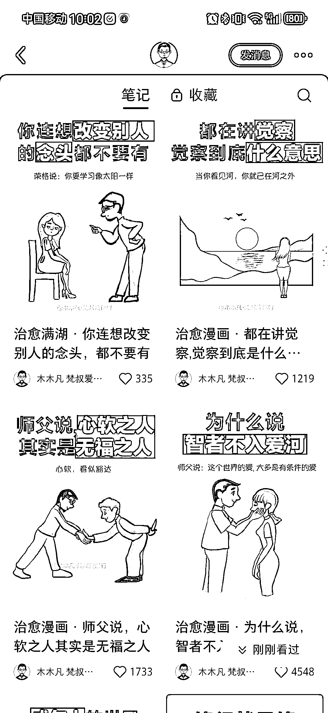
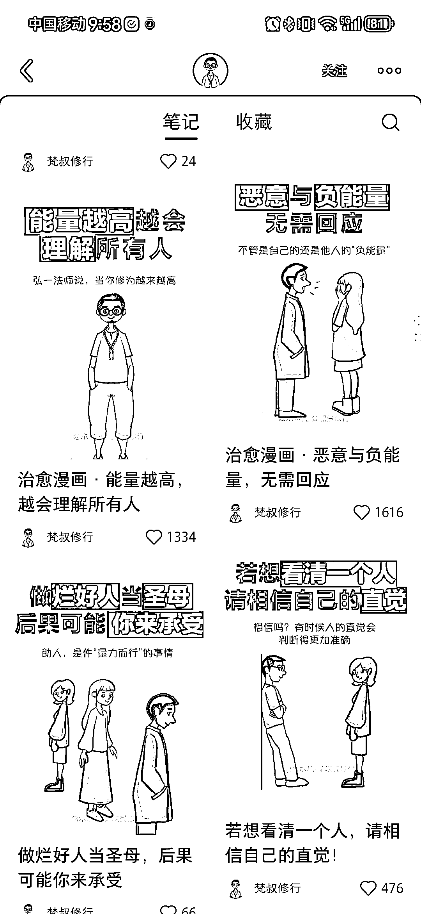

# 小红书身心灵赛道博主 1 个月涨粉 5w+，漫画治愈文案爆款

> 原文：[`www.yuque.com/for_lazy/xkrm14/twfnsgys08yligg0`](https://www.yuque.com/for_lazy/xkrm14/twfnsgys08yligg0)

作者： hedy

日期：2024-01-25

点赞数：**82**

* * *

正文：

小红书身心灵赛道-图文漫画 1 个月涨粉 5w+ 在小红书刷到一个身心灵赛道的博主，涨粉太猛了，几乎篇篇都是爆款。
笔记主要以漫画的形式，配上治愈的文案，他的漫画很有特色，里面的人也多是自己的漫画形象，重复出现打造人设，看他大小两个号流量都不错，这种形式很受欢迎。
通过群聊送免费课程的形式引流到私域卖高价冥想课来变现。

* * *

评论区：

牧言木语 : 这种是 AI 绘画还是手绘呀？

逍遥公子 : 今天突然发现 ps 就可以把照片当底图改成手绘。好长时间不做图，陌生了[调皮]。我又搜到，醒图其他也可以直接上传图片合成手绘效果。不过我没试。我去 ps 试试。[呲牙]

* * *

公众号搜索，懒人专属群分享