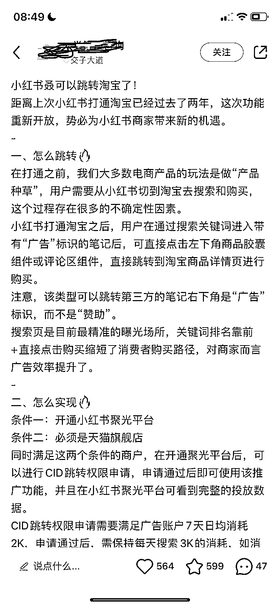
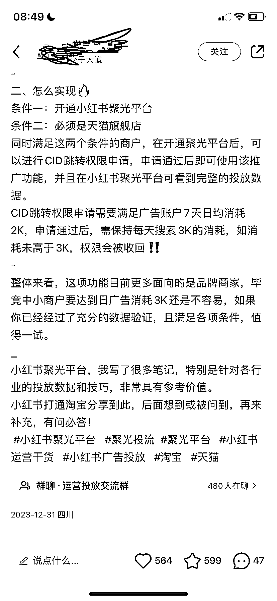
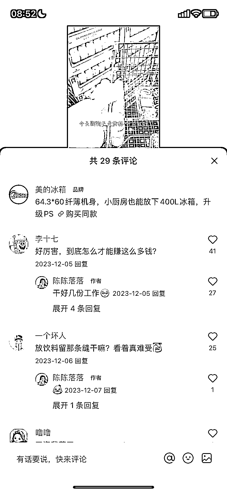
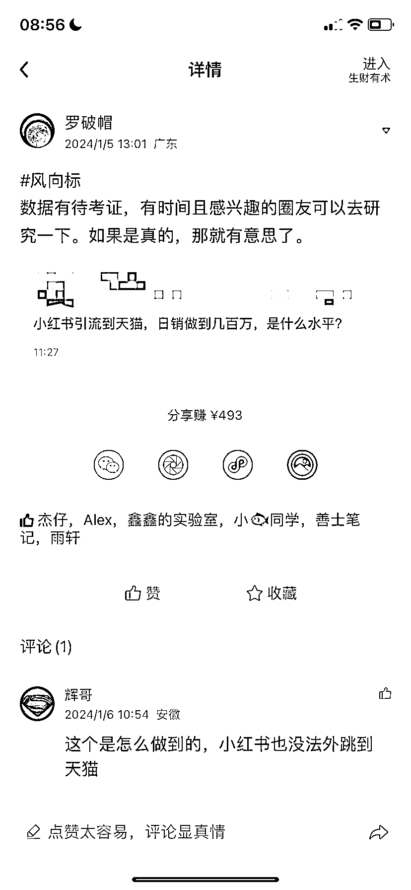

# 小红书开通淘宝跳转权限，日销几百万成真

> 原文：[`www.yuque.com/for_lazy/xkrm14/tgpbmoyxhpswqo21`](https://www.yuque.com/for_lazy/xkrm14/tgpbmoyxhpswqo21)

作者： 罗破帽

日期：2024-01-23

点赞数：**58**

* * *

正文：

【小红书可以跳转淘宝了】 一、门槛如下： ①只支持天猫旗舰店 ②开通小红书聚光平台
③开通后、CID 跳转权限需要申请，申请的前置条件为，前 7 天日均消耗 2k。如若申请通过，需保持每天搜索 3k 的消耗，如当日消耗未高于 3k，权限当日收回
二、测试了，是可以跳转淘宝、看来之前有人说日销几百万，大概率是真的。

* * *

评论区：

波叔 : 直接淘宝到引流了

* * *

公众号搜索，懒人专属群分享