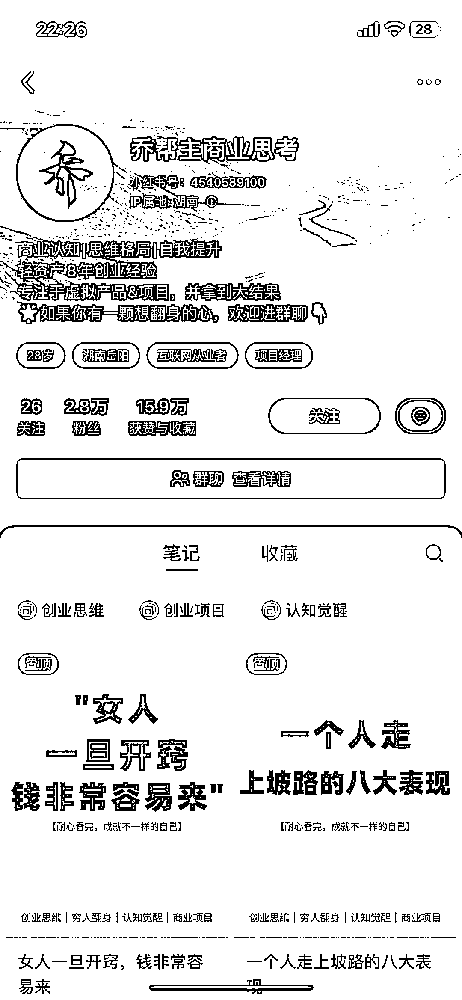
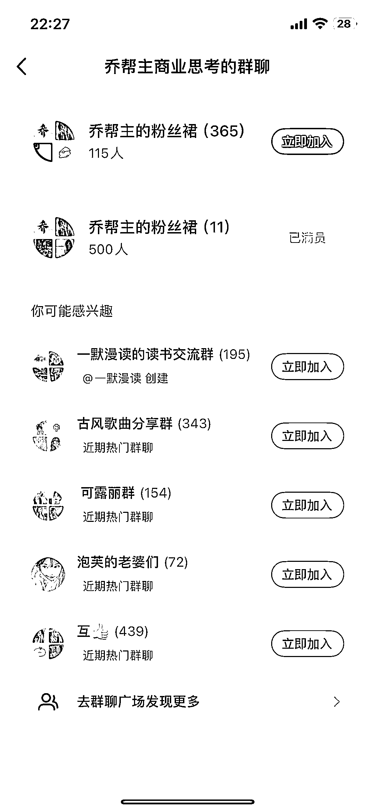

# 互联网创业风向标：小红书平台的副业机会和盈利空间

> 原文：[`www.yuque.com/for_lazy/xkrm14/cqhzq43bnyoezge3`](https://www.yuque.com/for_lazy/xkrm14/cqhzq43bnyoezge3)

作者： 地藏

日期：2024-01-22

点赞数：**58**

* * *

正文：

目标人群：想要在互联网创业的人 需求：人人都想搞个副业 平台和项目：小红书平台发布提升商业认知这类帖子，引流到小红书群，然后添加个人微信领取资料
盈利空间：训练营，卖课

* * *

评论区：

霍德胜 : 这不是乔帮主的么[憨笑]

地藏 : 不会在星球吧哈哈

霍德胜 : 应该是在

地藏 : 我搜了好像就在哈哈，圈子太小了

* * *

公众号搜索，懒人专属群分享