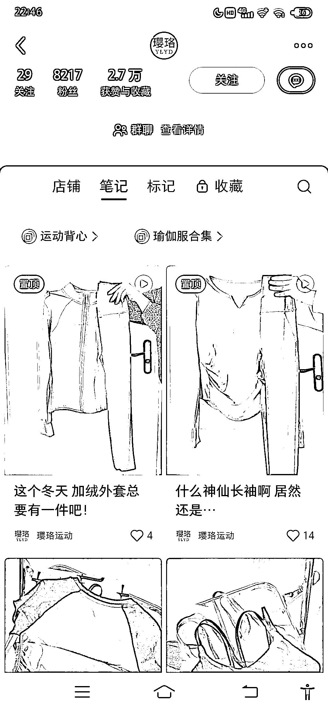
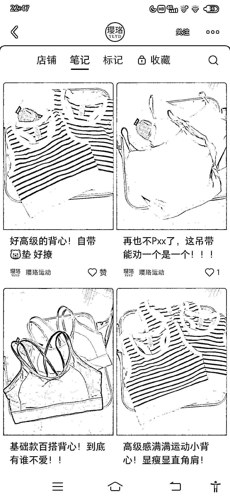
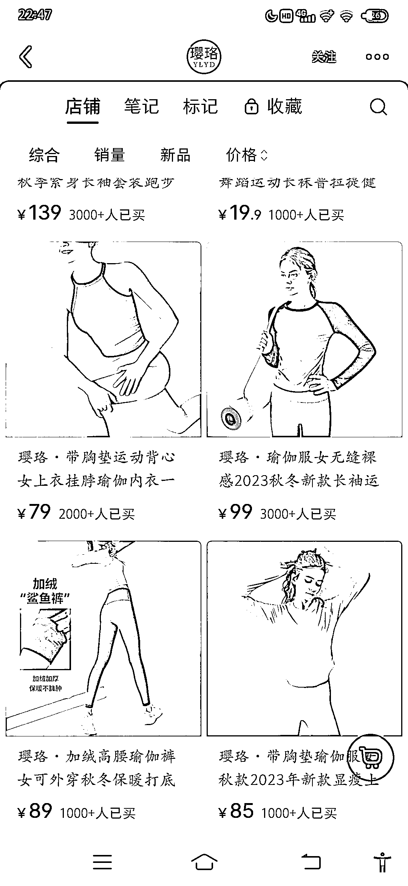
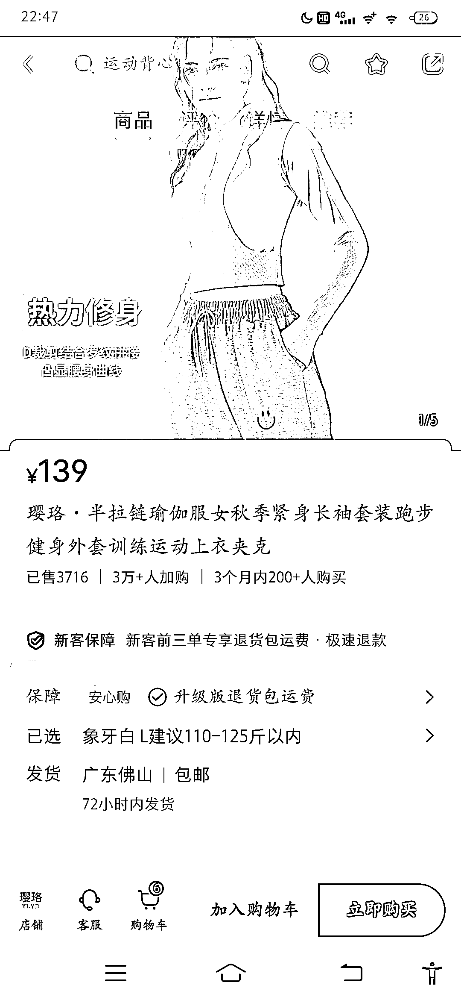
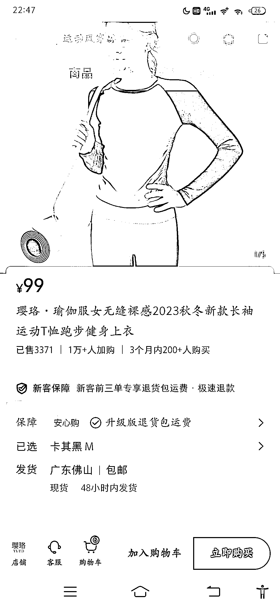

# 小红书粉丝 8000+，单品上衣 139 元和 99 元的，各卖了 3000+销量

> 原文：[`www.yuque.com/for_lazy/xkrm14/ap45z6edxldcb9vd`](https://www.yuque.com/for_lazy/xkrm14/ap45z6edxldcb9vd)

作者： 小七

日期：2024-01-25

点赞数：**42**

* * *

正文：

这个博主，粉丝 8000+，2023 年 12 月开始发笔记，笔记制作简单，款式常规简约，易搭。 店铺销量高，单品上衣 139 元和 99 元的，各卖了 3000+销量，
拼多多 1688 上衣进价 40 左右，目前利润 47 万+，其他单款也有部分销量。还有已加购 4 万+。 退货率算 50%，利润也有 20 万+。

* * *

评论区：

林林 AIGC 写作 : 你发的小红书账号都好有意思👍

小七 : 因为是新手，就想着从自己从能看懂的方向去捞下。对着手册一点点试😷

逍遥公子 : 我最近搜索低分爆款的，发现，好些笔记很少或没有，卖的不错。靠直播起来的。

小七 : 可以跟踪下[模式不一样，还是要看实际变现效果]

小林 : 低粉爆款的是哪个软件看的啊

小林 : 刚刷到你三条都中标了

小七 : 我手动搜的

* * *

公众号搜索，懒人专属群分享