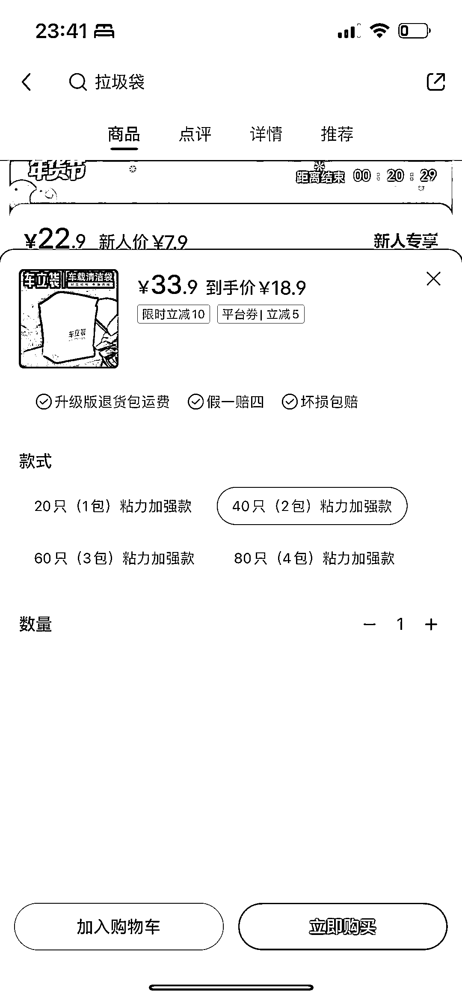
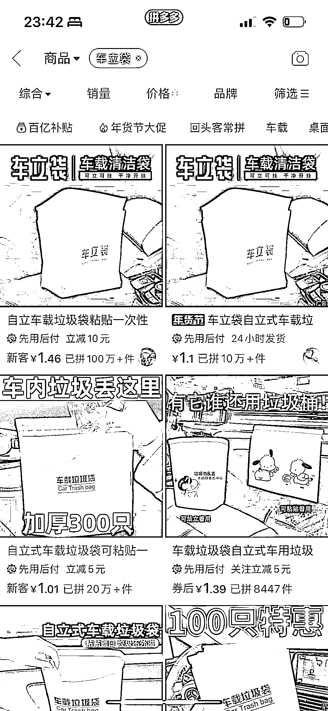
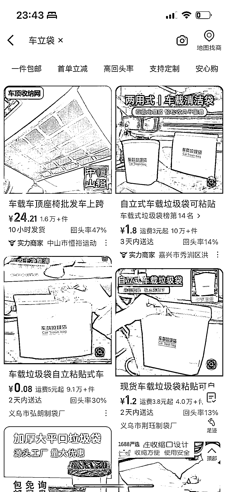
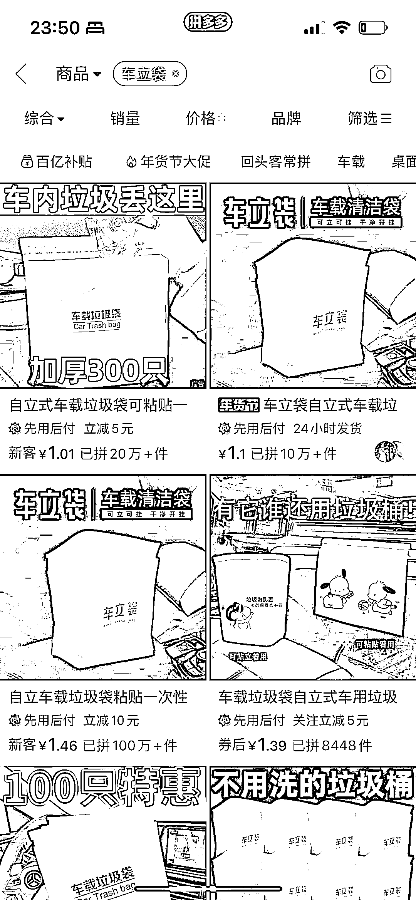
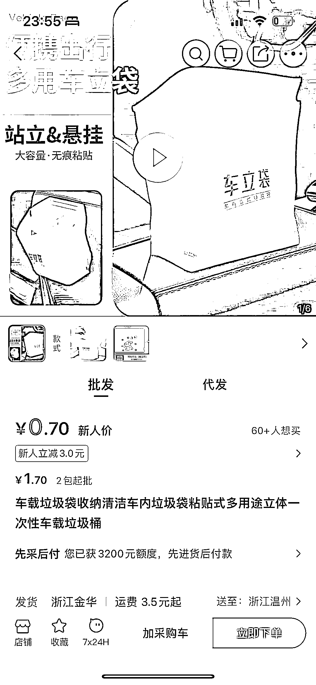

# 小红书上车立袋，垂直场景差异化产品销量领先

> 原文：[`www.yuque.com/for_lazy/xkrm14/buc3ir4umu8eztkv`](https://www.yuque.com/for_lazy/xkrm14/buc3ir4umu8eztkv)

作者： 真实姓名

日期：2024-01-22

点赞数：**45**

* * *

正文：

小红书上车立袋，可立可粘垃圾袋。 垂直场景做差异化产品 小红书销量 1.6 万，引流款 7.9 推荐款 18.9。 拼多多销量最高一百万，推荐款 12.88，
阿里巴巴销量十万多，推荐款加运费 6.9。 同品牌需要授权，有资源可以做竞品。

* * *

评论区：

小刀 : 这个商品挺好，放到车里。可以大卖

* * *

公众号搜索，懒人专属群分享