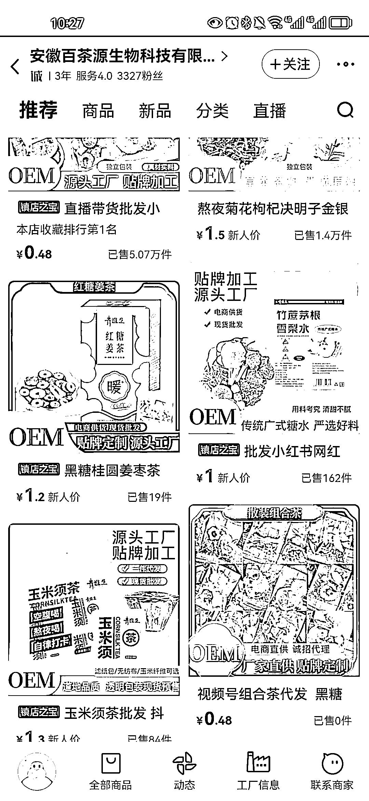
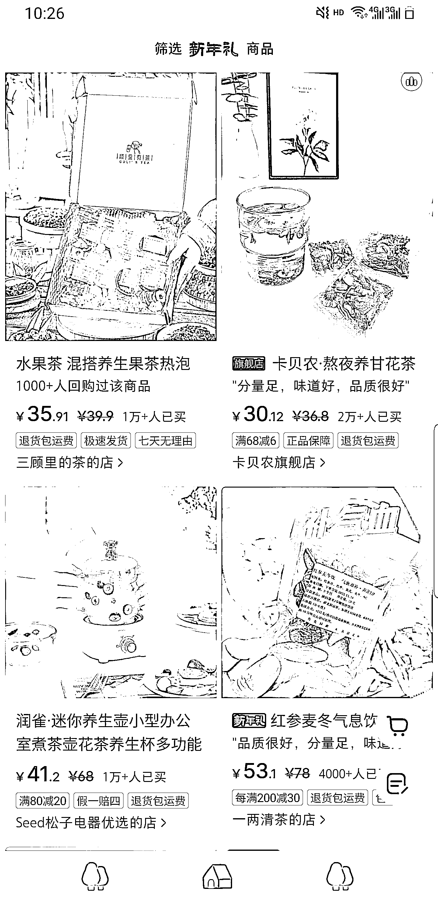
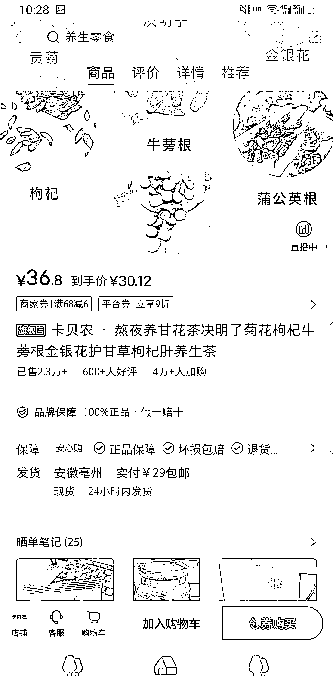
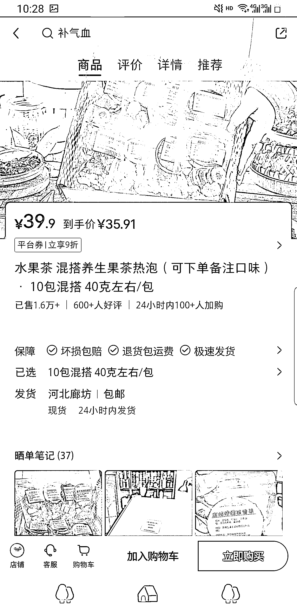

# 小红书养生茶饮：提高复购率的关键策略

> 原文：[`www.yuque.com/for_lazy/xkrm14/akougnc35gs12g35`](https://www.yuque.com/for_lazy/xkrm14/akougnc35gs12g35)

作者： 大圆子

日期：2024-01-22

点赞数：**42**

* * *

正文：

小红书养生茶饮，代工厂很多，成本在 7-10 元，售价在 30+，想要提高复购率的话需要增加一些成本，定制自己的包装，准备一些小礼品，日常多分享一些养生小常识

* * *

评论区：

曹玉娣 : 在小红书卖这些养生茶需要什么资质吗

星夜 : 圈友，第一张图片是什么平台

大圆子 : 阿里巴巴

饭小五 : 同问

The9 : 营业执照，经营范围包含有仅销售预包装食品

The9 : 1688

* * *

公众号搜索，懒人专属群分享