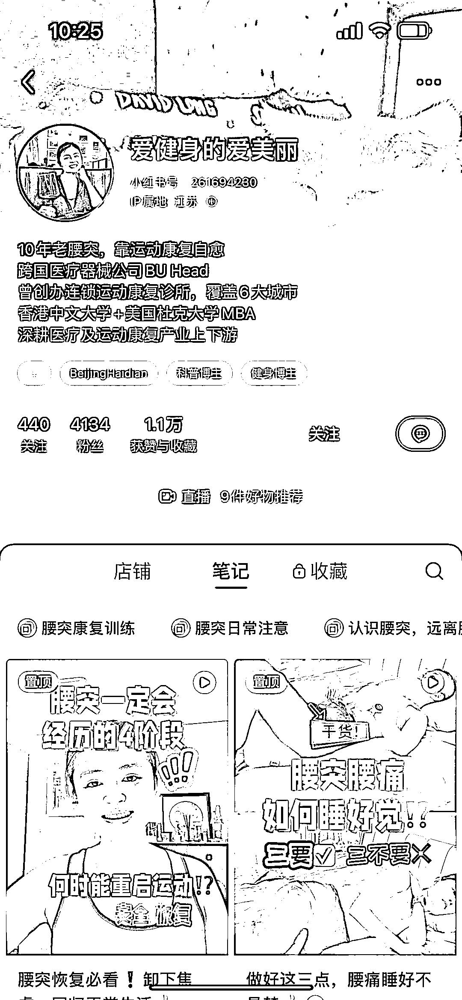
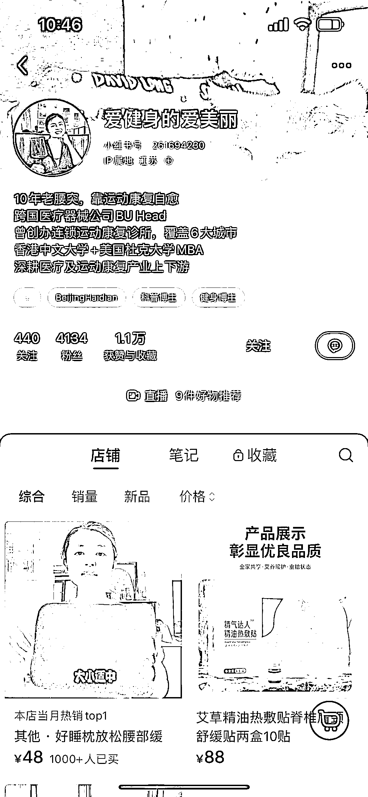
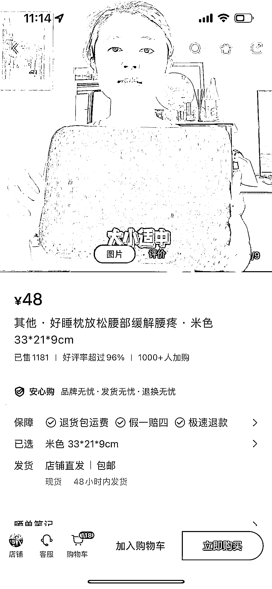

# 小红书上的腰突恢复指南，帮助改善腰突症状

> 原文：[`www.yuque.com/for_lazy/xkrm14/yw7u4zlbrtpe7d76`](https://www.yuque.com/for_lazy/xkrm14/yw7u4zlbrtpe7d76)

作者： 三个太阳

日期：2024-01-22

点赞数：**37**

* * *

正文：

目标人群：腰间盘突出人员 需求：改善腰突症状
平台和项目：在小红书上发布关于腰突恢复的一些动作，注意事项，好物分享，吸引目标客户注意，笔记左下角挂商品链接，直播答疑挂商品链接
盈利空间：店铺好睡枕，单价 48 元，已售 1181 件，合计销售额 5W 多

* * *

评论区：

* * *

公众号搜索，懒人专属群分享