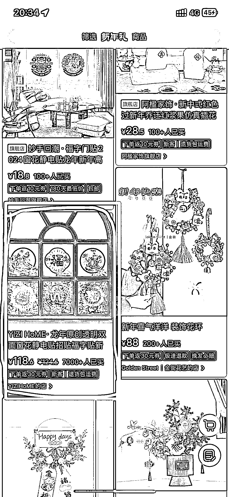
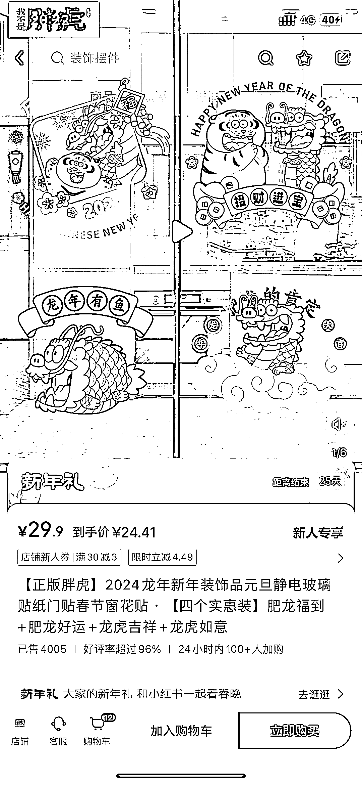
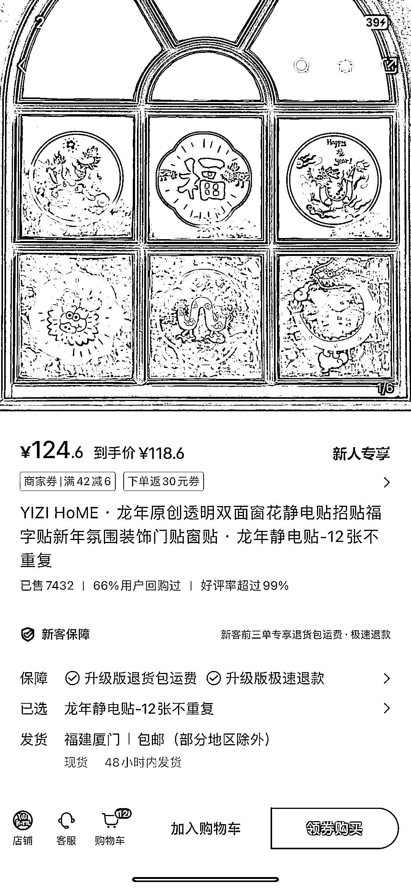
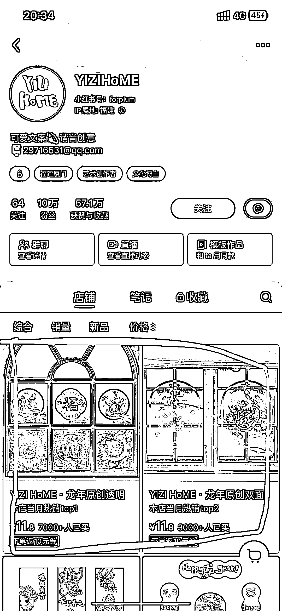
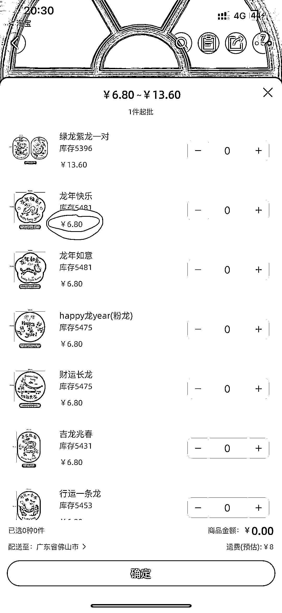

# 小红书新年窗贴：创意感强，透明感突出，受年轻人喜爱

> 原文：[`www.yuque.com/for_lazy/xkrm14/qlfvb844fv2wefns`](https://www.yuque.com/for_lazy/xkrm14/qlfvb844fv2wefns)

作者： 酥婷🌵

日期：2024-01-22

点赞数：**37**

* * *

正文：

平台和项目：小红书 新年窗贴
我在搜索新年装饰的时候这种有创意透明感很强的并且高客单的窗贴销量挺不错的，这种感觉的窗贴可能更加符合年轻人的审美需求与传统的大红并很实的窗贴不同，这种创意感强的更具有时尚性。
1688 平台：搜索了 1688 平台也是有这款产品的单个价格是 6.8 在小红书平台单个买到 11.8
并且从搜索也可以看到他做了一个组合装的处理，价格也是标价到很高，但是它的销量和店铺里的第二个连接相比是销量第一的。可能🤔️组成一个系列感的窗贴呈现会让更多人去下单，毕竟窗贴也不会只买一款。

* * *

评论区：

* * *

公众号搜索，懒人专属群分享