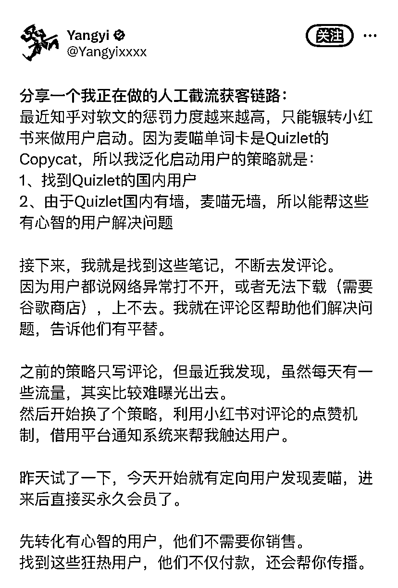

# 利用小红书点赞机制，提高笔记评论曝光概率的方法

> 原文：[`www.yuque.com/for_lazy/xkrm14/ll6ckr4n3orxboki`](https://www.yuque.com/for_lazy/xkrm14/ll6ckr4n3orxboki)

作者： suzong

日期：2024-01-22

点赞数：**32**

* * *

正文：

小红书 🍠截流获客链路方法 「利用小红书对评论的点赞机制，借用平台通知系统来帮我触达用户。」 点赞了之后他们会去看，对应的笔记评论是哪个。
于是有机会能增加该笔记下，你的评论曝光概率，把消息触达给他。 除此之外他也可能会去访问我的主页，去看到他需要的东西。
这种可以开始可以人工，后续成熟可以借助 RPA 提高效率。

* * *

评论区：

小辣椒 : 啥意思呀，没看懂呢，求指教

suzong : 1、定位和包装好你的账号和笔记。建议是某个产品的同名账号 2、然后去和你同用户群体的笔记下点赞用户的评论
3、这些用户会收到 app 通知，然后根据你的账号名称去进一步了解你，如果你产品能解决用户的痛点，用户可以进一步自发转化。

倪大胖 : 点赞用户的评论好像没有提醒的吧

* * *

公众号搜索，懒人专属群分享