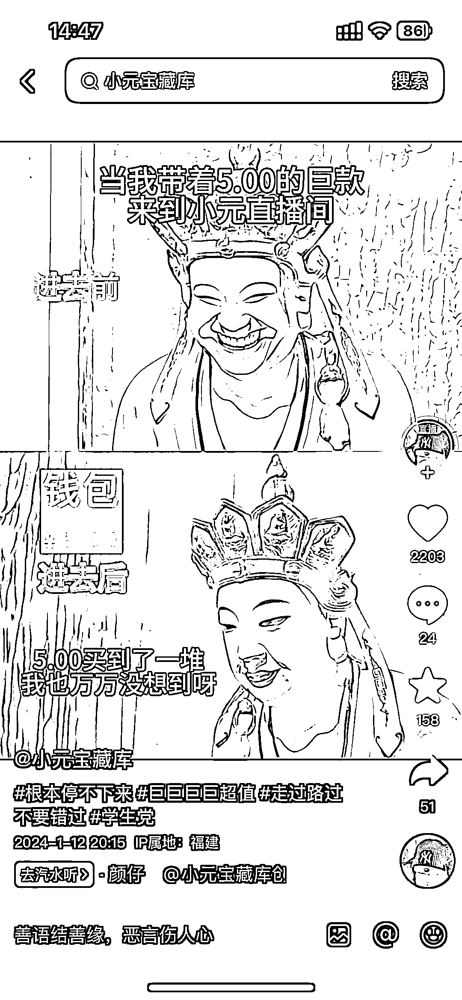
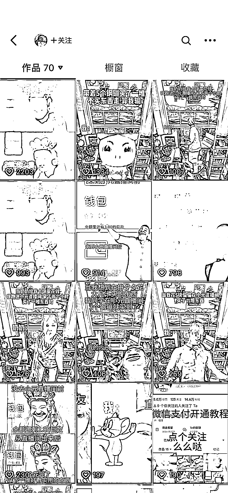
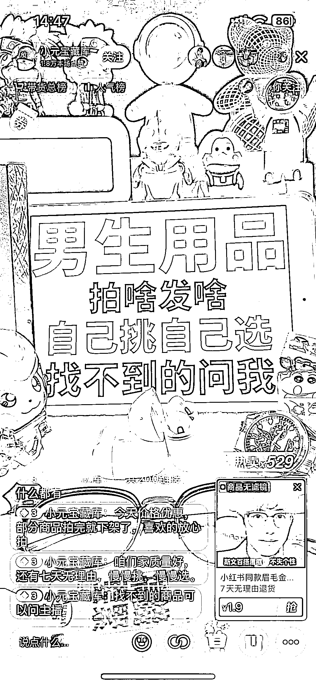
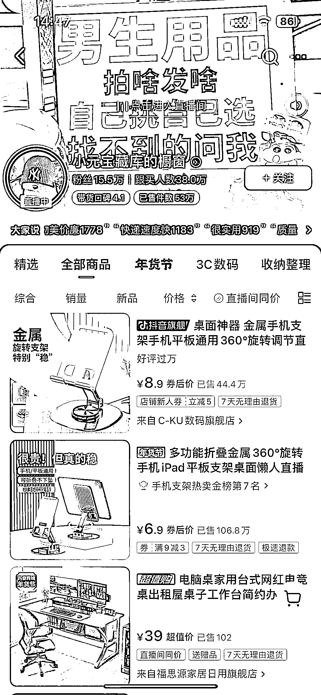

# 抖音平板直播卖货案例，买家达到 38 万人次

> 原文：[`www.yuque.com/for_lazy/xkrm14/th8z6858rrwcnz0w`](https://www.yuque.com/for_lazy/xkrm14/th8z6858rrwcnz0w)

作者： 老成

日期：2024-01-22

点赞数：**48**

* * *

正文：

抖音不出镜卖货案例，跟买人数 38w。 一个平板配上文字，吸引用户注意，加上周围商品点缀，音乐 bgm 以及讲解，一个直播间就搭配起来了。
商品主要是百货，数码，男士用品，饰品，小零食等等，主打便宜精品店。 视频大部分也是相同模板，没想到几元可以买这么多东西。
简单可复制，配上一点视频加热，效果应该不错。

* * *

评论区：

* * *

公众号搜索，懒人专属群分享