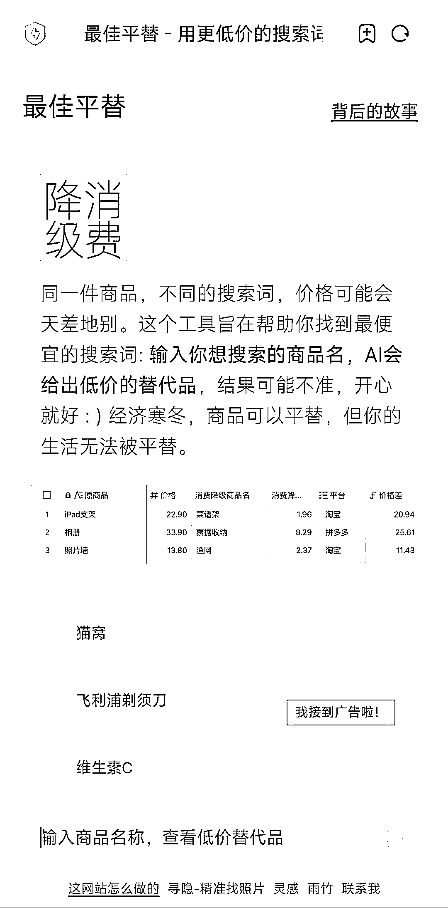
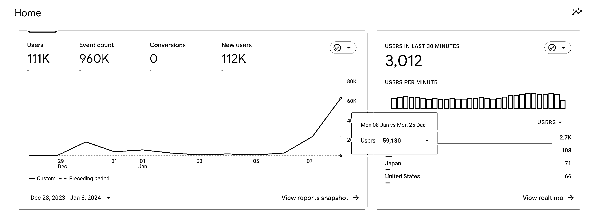
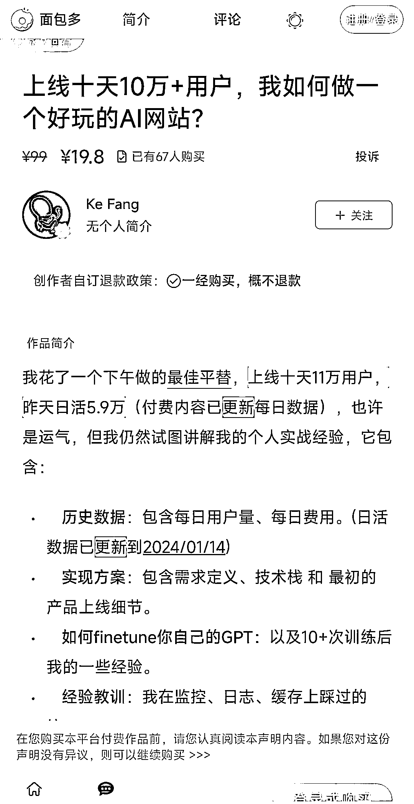
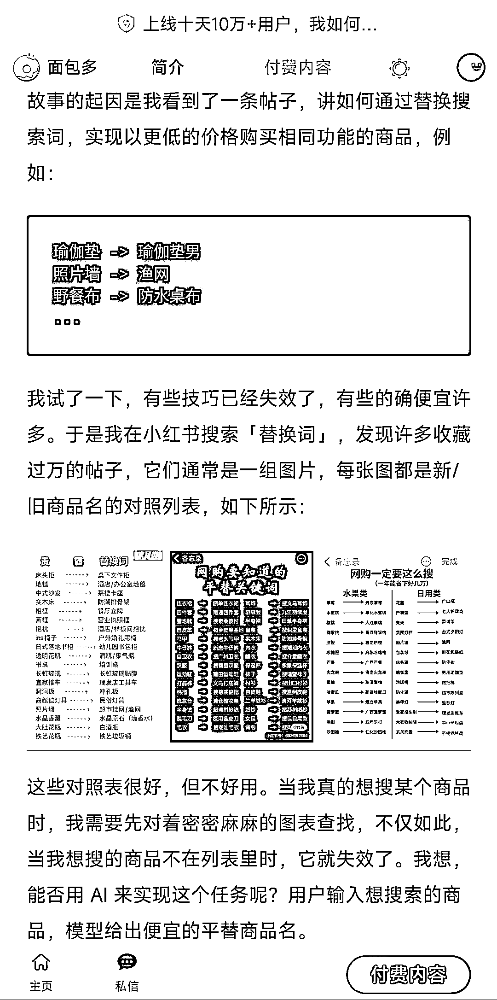

# AI 工具站帮助消费者实现消费降级，用户量迅速增长

> 原文：[`www.yuque.com/for_lazy/xkrm14/eomi92blcc5tmubc`](https://www.yuque.com/for_lazy/xkrm14/eomi92blcc5tmubc)

作者： Eilvo

日期：2024-01-22

点赞数：**57**

* * *

正文：

分享一个挺有意思的工具站。 用 AI 做商品搜索词平替，帮助消费者做消费降级。
消费降级确实是一个需求，但用了一下，发现搜索结果并不那么准确，但似乎并不影响这个网站火起来。据作者分享，一个下午完成的网站，上线 10 天 11w 用户，某天日活 5.9w。或许用于娱乐也是他满足的一个需求之一。
作者是如何发现这个小需求的?
详见图 4，来自作者挂在网站上的一篇付费文章，由于是付费内容，为了尊重作者知识产权，这里只截了一部分内容给大家分享，有需要的可以去这个网站上付费看全文。
作为一个目前拥有 14w+用户的一个工具站，据作者透露，目前变现仍然为 0，尝试过挂其他产品链接，google
ads（申请被拒），淘宝联盟等，都效果不佳，有好的商业变现方式可联系作者。 作者联系方式在付费文章有，我这里顺便挂上，给有需要的人吧~
vx：Mazzzystar [最佳平替 - 用更低价的搜索词购物](https://www.pingti.app/)

* * *

评论区：

Eilvo : 感谢老大[玫瑰][玫瑰][玫瑰]

九帆 : 这个工具有意思

* * *

公众号搜索，懒人专属群分享