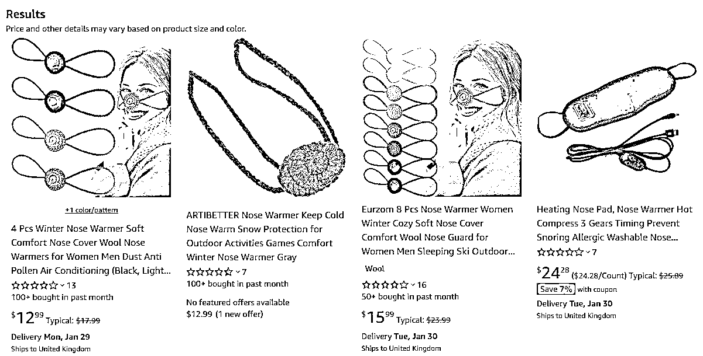
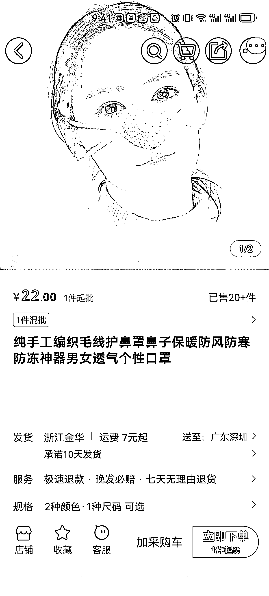
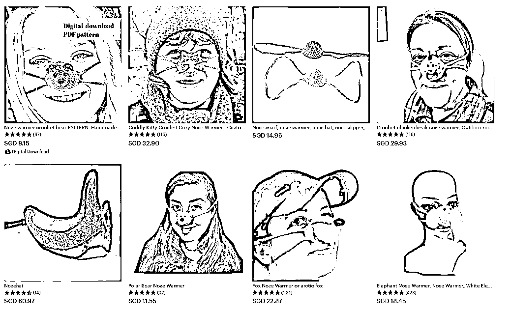

# 火爆 TikTok 的新型迷你口罩“鼻巾”，保护鼻子避免冻伤

> 原文：[`www.yuque.com/for_lazy/xkrm14/ssxcponr4add4fly`](https://www.yuque.com/for_lazy/xkrm14/ssxcponr4add4fly)

作者： 兰心

日期：2024-01-26

点赞数：**56**

* * *

正文：

最近一种 mini 口罩，“鼻巾”火出圈。使用方法也跟口罩类似，用带子挂在耳朵上进行固定，主要是保护鼻子避免冻伤。TikTok
上关于“鼻巾”的话题讨论热度也开始迅速飙升。仅 #NoseScarf 话题标签下的浏览量已高达 242 亿次。在亚马逊 13-16 美金，1688 批发价 22 元。

* * *

评论区：

兰心 : 感谢亦仁大大！

* * *

公众号搜索，懒人专属群分享