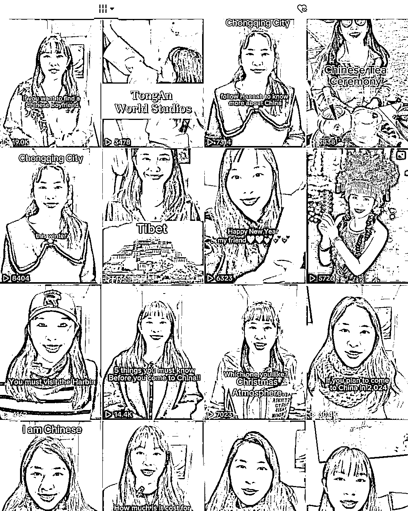
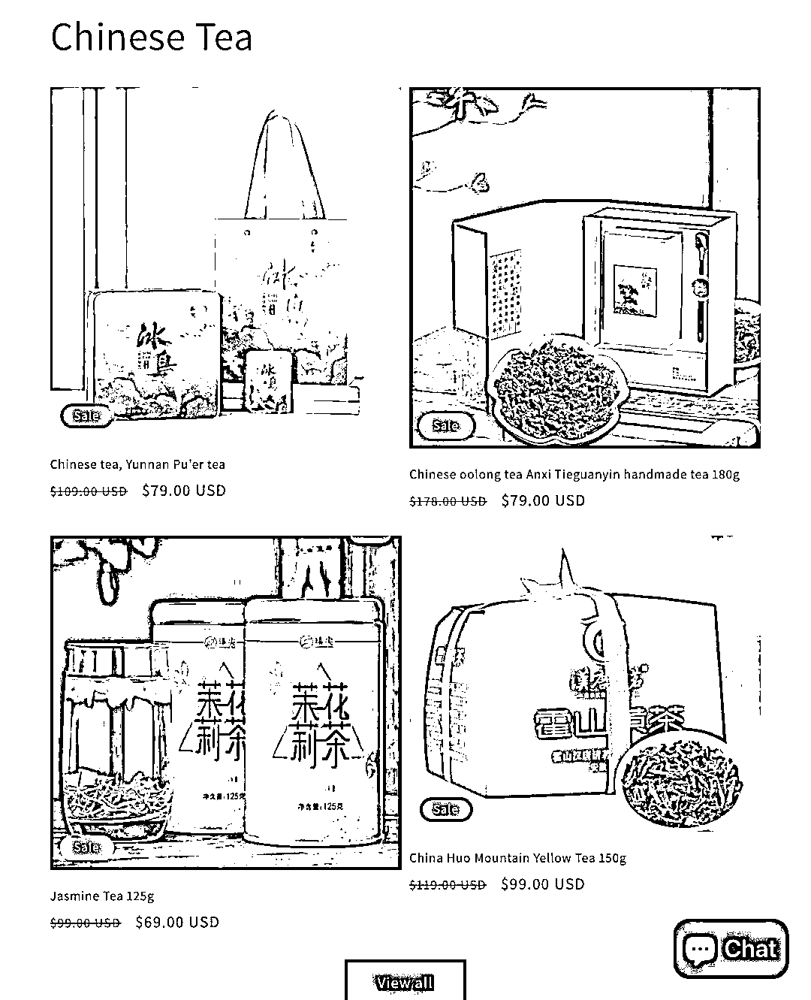
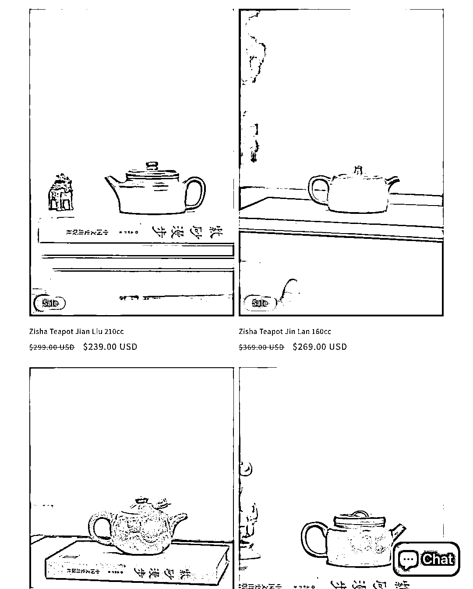

# 通过 TikTok 了解中国茶文化，盈利空间巨大

> 原文：[`www.yuque.com/for_lazy/xkrm14/fbsfxwv2tgz9qisu`](https://www.yuque.com/for_lazy/xkrm14/fbsfxwv2tgz9qisu)

作者： 斑马森林

日期：2024-01-22

点赞数：**40**

* * *

正文：

目标人群：对中国茶文化感兴趣的老外用户 需求：希望有个可以渠道了解中国茶文化
平台：通过在 TikTok 上输出中国文化内容，比如传统文化，中国习俗，旅游资讯等，吸引精准用户，直播引流卖茶具，茶盏，茶叶
盈利空间：非标品，高客单，引流私域，复购强

* * *

评论区：

HDDD : 国外的私域是啥

* * *

公众号搜索，懒人专属群分享