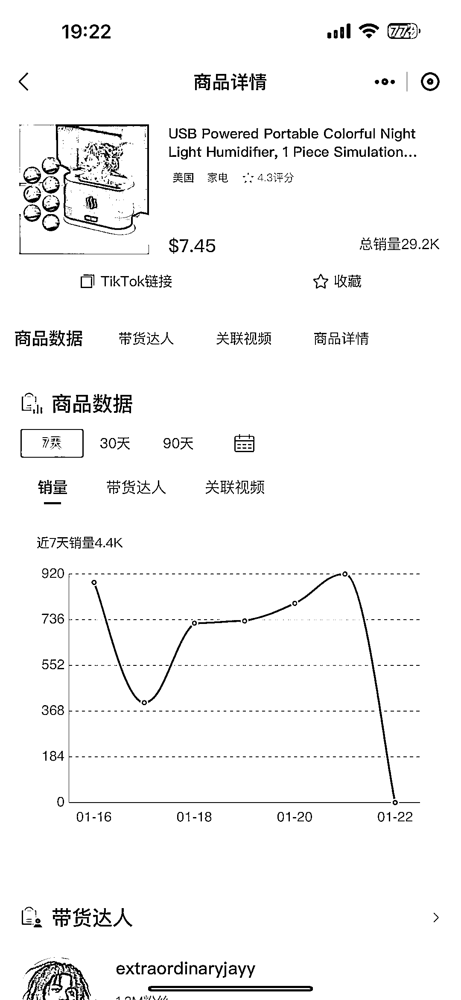
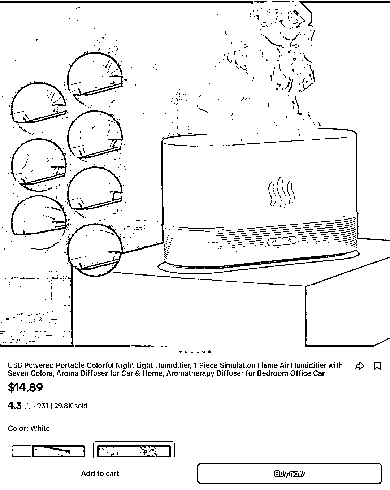
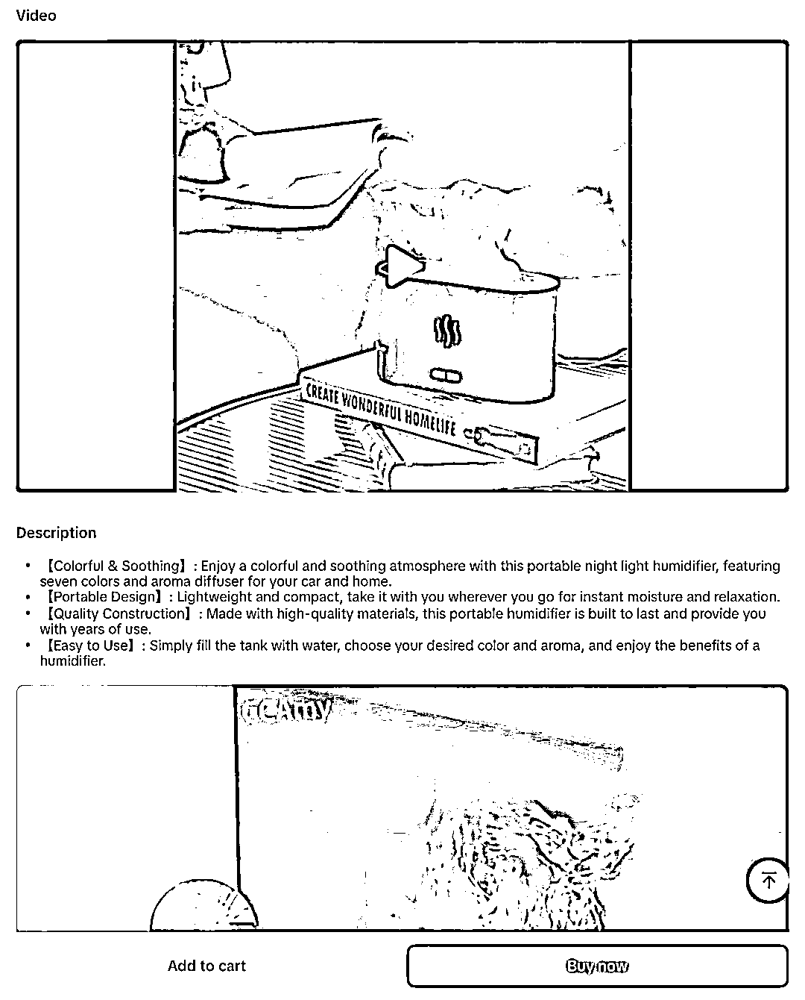

# 欧美人热衷的加湿器，小巧便携，TikTok 上已售出 29.2K 件

> 原文：[`www.yuque.com/for_lazy/xkrm14/ma5e4hopfxthoag1`](https://www.yuque.com/for_lazy/xkrm14/ma5e4hopfxthoag1)

作者： 斑马森林

日期：2024-01-22

点赞数：**28**

* * *

正文：

加湿器一直是欧美的热门产品，尤其是在冬季，欧美人经常会因为空气湿度下降出现皮肤开裂，鼻窦炎、鼻子流血和嘴唇干裂等问题。每到这个季节，他们都会使用加湿器来解决室内干燥问题。
这款具备 USB 接口的加湿器，形状小巧，便于携带，目前在 TikTok 上售价为 7.45-14.89 美金，共计已售出 29.2K 件。
TikTok 在选品上，可以结合欧美人的一些生活习惯，气候等来选品，这类型的产品进行一点微创新，都很容易成为爆品。

* * *

评论区：

* * *

公众号搜索，懒人专属群分享