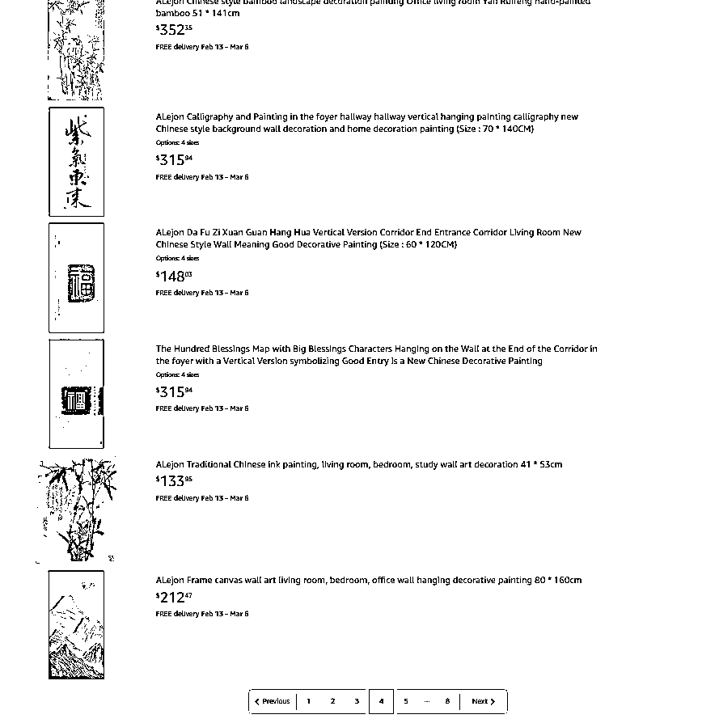
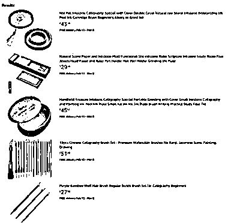
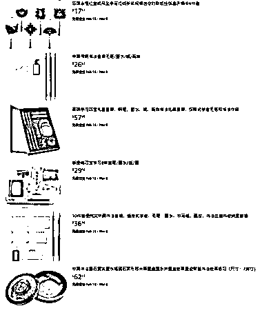
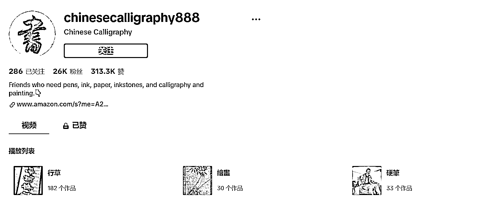
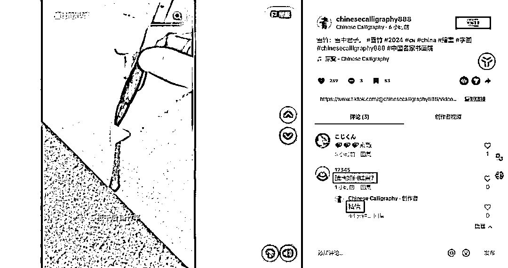
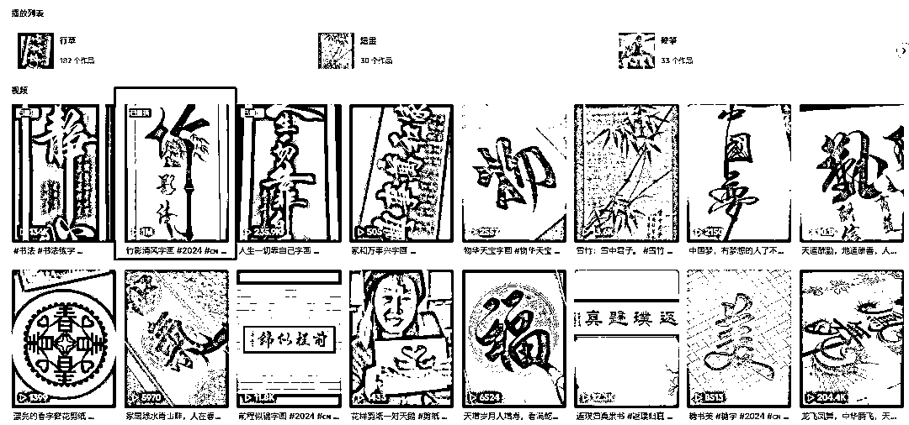

# tik tok 上的中国书法视频卖货，高价商品引流私域

> 原文：[`www.yuque.com/for_lazy/xkrm14/upe6d87ciml33zih`](https://www.yuque.com/for_lazy/xkrm14/upe6d87ciml33zih)

作者： 北柱

日期：2024-01-22

点赞数：**27**

* * *

正文：

平台和项目：tik tok 发布中国书法视频卖货 目标人群：对书法感性的 tik tok 用户
变现：①视频播放收益，单条视频最高播放 1 百万次；②卖货，引流到亚马逊等卖货；③其它方式。 盈利空间：暂不清楚
博主的粉丝不多，但是也有不少几十万播放量的视频，卖货商品包括钢笔，墨水，纸张，书法以及绘画，单价很高我，几乎都是十几美元起步，甚至更高的商品售价达到几百美元。长期做下去，可以尝试将 tk 上面的用户引流到私域。

* * *

评论区：

* * *

公众号搜索，懒人专属群分享