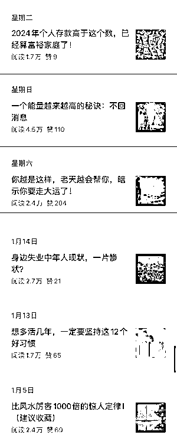

# 新晋公众号挑战头部垄断，以实用观点文赢得读者青睐

> 原文：[`www.yuque.com/for_lazy/xkrm14/ekgdvcili1li9cay`](https://www.yuque.com/for_lazy/xkrm14/ekgdvcili1li9cay)

作者： 林林 AIGC 写作

日期：2024-01-26

点赞数：**65**

* * *

正文：

这个公众号是去年 12 月 21 日才成立的，虽然只有 6 篇爆款，而且还没有“10 万+”，但是也给我带来了启发。
如今公众号头部的阅读量几乎被《十点读书》《洞见》《拾遗》等公众号的观点文给“垄断”了，而这个公众号的选题其实和《十点读书》《洞见》《拾遗》等公众号也很相似，几乎都是关于人生思考、心灵鸡汤的观点文，我看了其中一两篇，整体结构都很短平快，和《十点读书》《洞见》《拾遗》等公众号截然不同，直接上干货、上观点，提升了文章的实用价值。
这类选题的另一优势也是我在星球内部分享公众号风向标时反复提到的长尾价值，其实之前去听十点读书总编辑的讲座的时候我也知道了这样的选题也是很多中老年读者最关心的，如果认真写的话，中老年读者们也是愿意为你的账号买单的。

* * *

评论区：

* * *

公众号搜索，懒人专属群分享