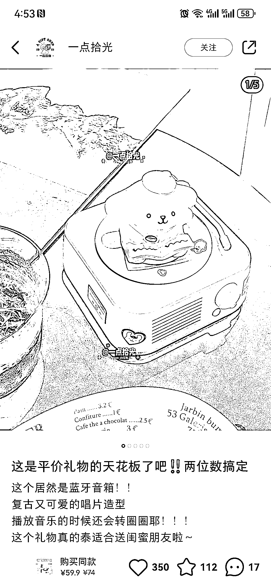
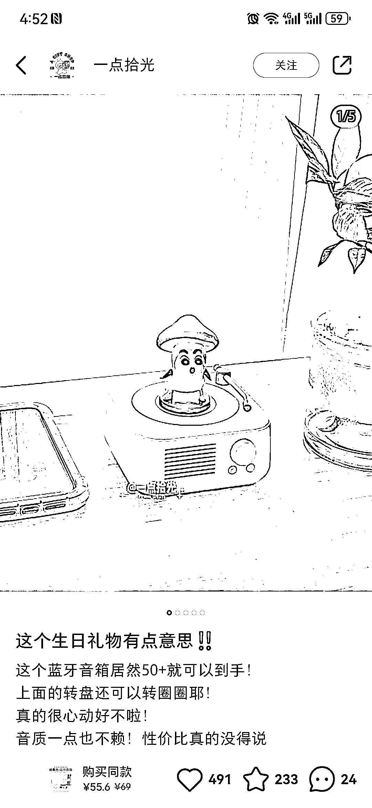
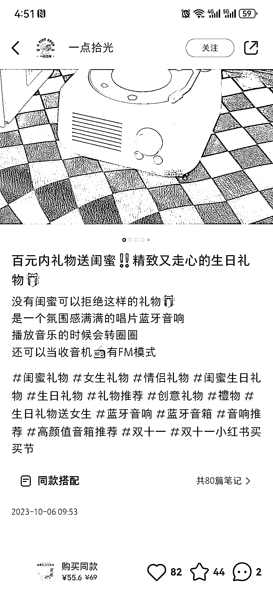
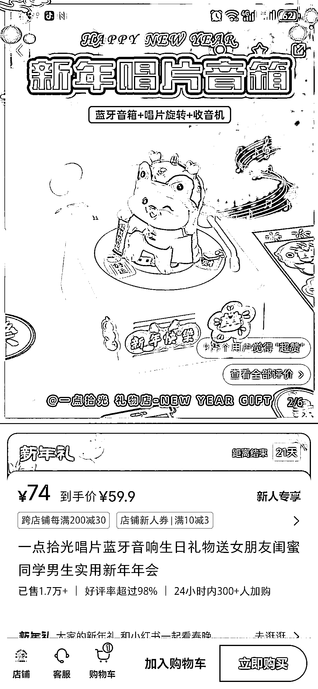

# 复古蓝牙音箱唱片机，小红书选品礼物，销量 1.7 万+，利润可观

> 原文：[`www.yuque.com/for_lazy/xkrm14/egu5viy4o5phupxy`](https://www.yuque.com/for_lazy/xkrm14/egu5viy4o5phupxy)

作者： 谢糖糖

日期：2024-01-26

点赞数：**66**

* * *

正文：

#风向标 赛道+项目:小红书选品礼物 氛围感满满的唱片蓝牙音响，播放音乐的时候会转圈圈，还可以当收音机有 FM 模式
这是一个礼物集合店，复古蓝牙音箱唱片机，博主从 2023 年 10 月开始发这个系列的款数据都不错，没有大爆款，但是换个标题和首图数据都还不错，上面加的不同的玩偶，最近是过年主题的玩偶！
评论区，点赞都挺高。多多 1688 进价 40 左右，这个店卖 63，1.7 万+销量。这个利润还是不错的。同时其他品也带着有些销量。

* * *

评论区：

谢糖糖 : 新年主题的卖 63

谢糖糖 : 哇！第一次发居然中标啦！感谢！

* * *

公众号搜索，懒人专属群分享