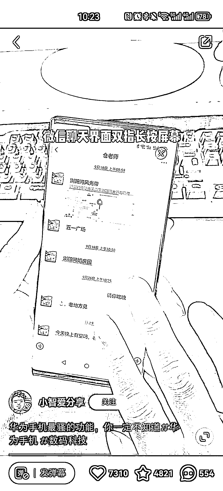

# 鸿蒙系统隐藏技能：微信对话界面两指长按，打码姓名或关键话语

> 原文：[`www.yuque.com/for_lazy/xkrm14/aop7rungkvresx3r`](https://www.yuque.com/for_lazy/xkrm14/aop7rungkvresx3r)

作者： 南极没有北极熊

日期：2024-01-22

点赞数：**48**

* * *

正文：

鸿蒙系统隐藏技能 看到小红书的一个数码博主分享了一个鸿蒙系统隐藏功能，点赞 7310，收藏 4821，属于异常值。
这个功能就是在微信对话界面，两指长按，就可以直接给姓名或者关键话语打码。 这个功能确实很新鲜，没见过。
思考：把华为手机应用技巧做精做细，可以长期做下去，也会有粉丝基础。

* * *

评论区：

常常 : 有启发，品牌手机都有一些差异化的功能，小米、苹果、华为，都可以

* * *

公众号搜索，懒人专属群分享