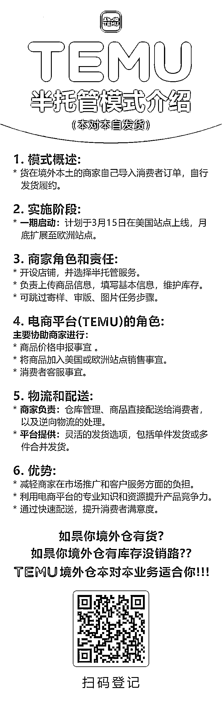

# 拼多多跨境 TEMU 计划于 3 月开启半托管模式，给本土商家带来红利

> 原文：[`www.yuque.com/for_lazy/xkrm14/mtg97v0k9vd3n2ya`](https://www.yuque.com/for_lazy/xkrm14/mtg97v0k9vd3n2ya)

作者： 元宝

日期：2024-01-24

点赞数：**42**

* * *

正文：

TEMU 计划在今年 3 月开启半托管模式。
全球各个国家地区本土有货的商家，红利来了！拼多多跨境 TEMU 本对本业务预计 3 月启动，到时候会主力推大家能做的卖家，到时候不会走现在的审版核价体系，会调整，不用担心现在模式问题成本问题。
要开始新方向了。

* * *

评论区：

* * *

公众号搜索，懒人专属群分享