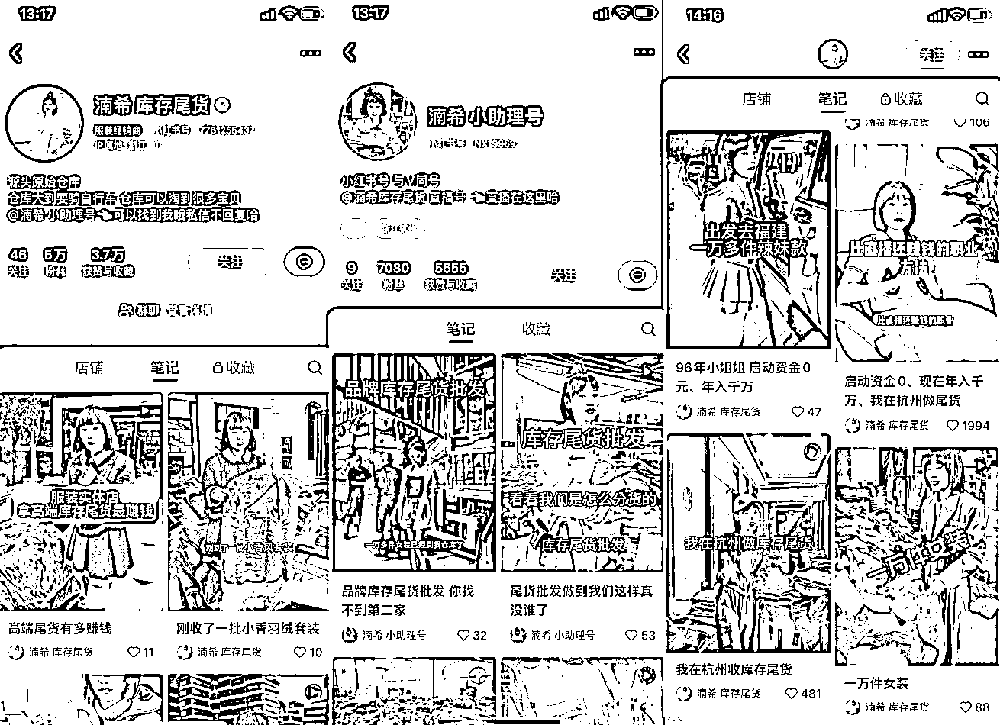
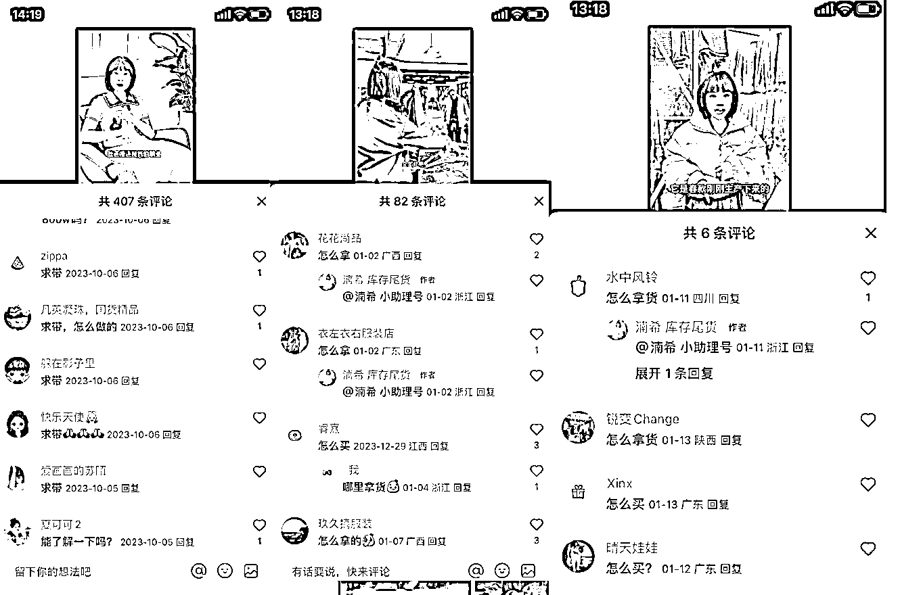

# 杭州服装尾货账号：成功创业者包装，流量爆棚，赚钱机会多

> 原文：[`www.yuque.com/for_lazy/xkrm14/mmztaiuzw52gvy2a`](https://www.yuque.com/for_lazy/xkrm14/mmztaiuzw52gvy2a)

作者： Kali

日期：2024-01-22

点赞数：**37**

* * *

正文：

这个做杭州服装尾货的账号。老板给自己包装成一个成功创业者，赚了几千万的女创业者。然后晒的都是大牌尾货去哪了，这种类似行业信息差的内容很容易有流量。4 个月涨粉 5 万，不确定有没有投流。她开了一个小号做直播。
账号下面都是求买求拿货的，求带赚钱，求买衣服的。
我看她的业务模式应该有三种：1，包装自己的尾货盘，招代理。2，小 b 端的批发。3，针对个人的卖货。如果要做这样的服装尾货账号门槛高吗？是不是可以随便找一个服装市场是拍视频就好了，并不需要很大的资源来获得这些尾货？

* * *

评论区：

* * *

公众号搜索，懒人专属群分享