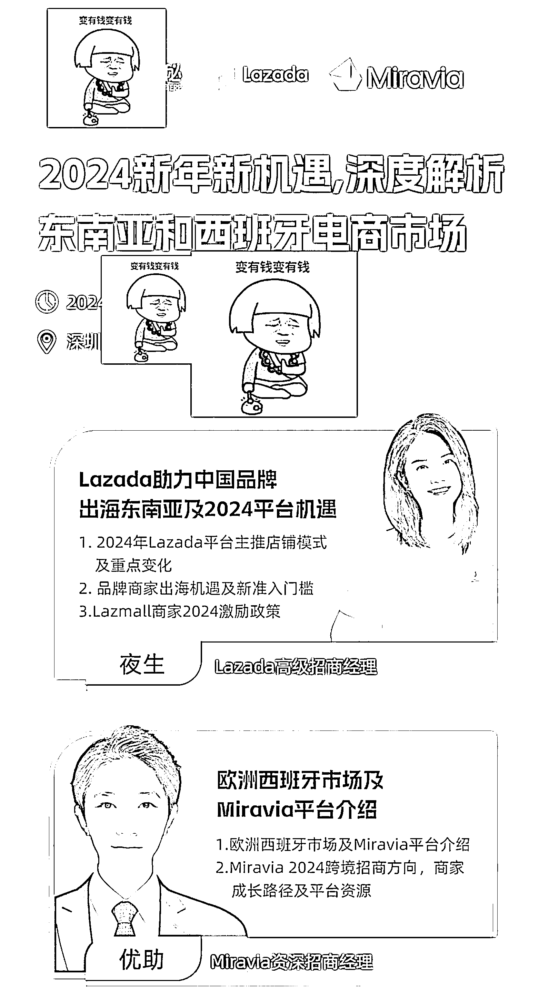
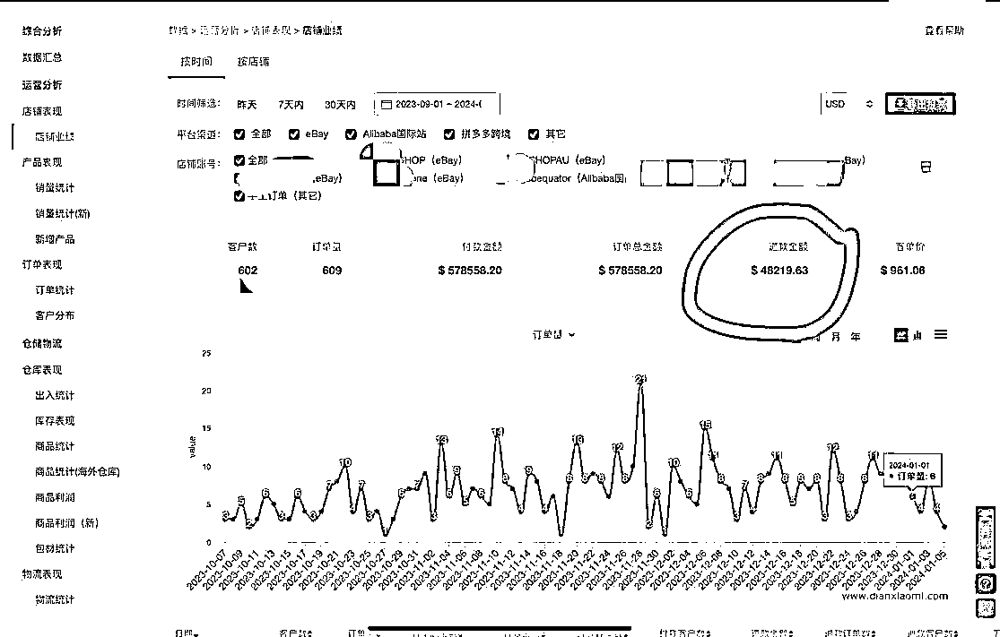

# 西班牙市场招商会是风向标，申请难度大且店铺涨价难免

> 原文：[`www.yuque.com/for_lazy/xkrm14/hk2esrn0h3u2581d`](https://www.yuque.com/for_lazy/xkrm14/hk2esrn0h3u2581d)

作者： 李方元

日期：2024-01-26

点赞数：**26**

* * *

正文：

做西班牙市场的朋友，可以多参加线下招商会，因为没有直播和录播。很多问题，需要面对面的问招商经理。申请难度很大，一个每个月 1 百多万营业流水的 eBay，没申请到店铺。需要找第三方买店铺，所以，这个平台的店铺涨价也难免[闭嘴]

* * *

评论区：

小四 : 注册个万里汇，走里面的招商渠道。我试着还行

李方元 : 谢谢大佬指点，大佬发大财🙏🙏🙏👍👍👍💰💰💰💰

小四 : 你是大佬。我是小弟[捂脸]。万里汇，lzdaza。Mi 不都是一家的吗，会好注册一些

李方元 : 好的，谢谢哈，一起发大财。

* * *

公众号搜索，懒人专属群分享