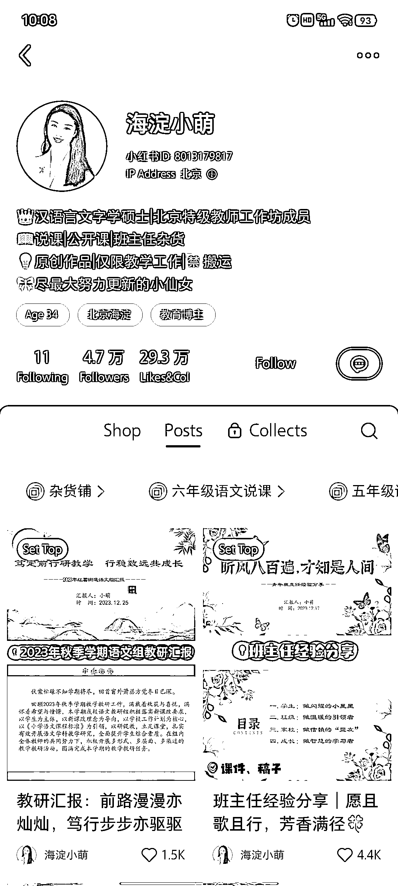
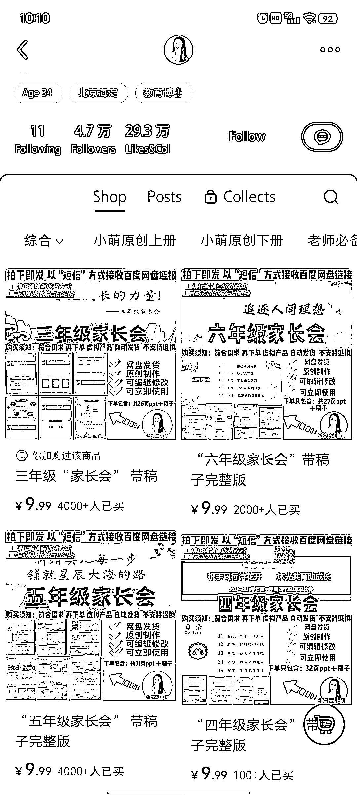
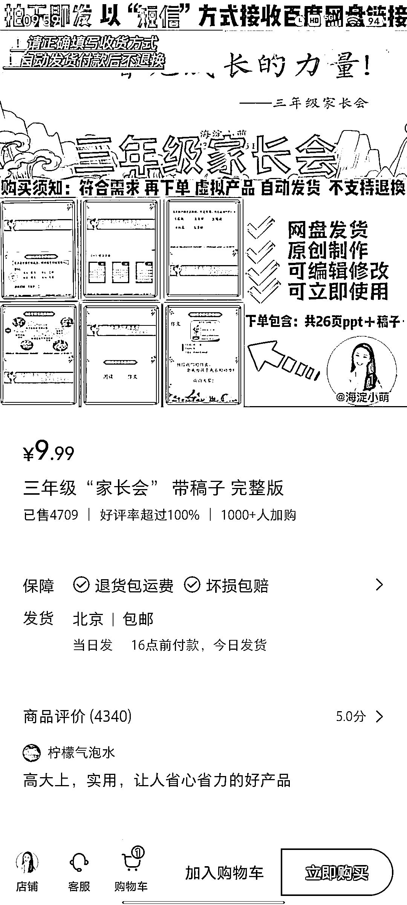

# 小学老师开家长会必备课件，小红书平台提供教学资源笔记

> 原文：[`www.yuque.com/for_lazy/xkrm14/gp9ykhccg32e1npr`](https://www.yuque.com/for_lazy/xkrm14/gp9ykhccg32e1npr)

作者： 时空

日期：2024-01-22

点赞数：**35**

* * *

正文：

目标人群：小学老师 需求：开家长会需要课件
平台和项目：在小红书平台上，发布关于语文老师和班主任的教学资源的笔记，吸引目标用户，笔记左下角挂相关商品链接，引导用户购买 盈利空间：
1.家长会 PPT 客单价 9.99，已售出至少 10000+份，盈利至少 9.99*10000=99900 2.外加网盘拉新的收入

* * *

评论区：

谈谈心 : 这是原创的的 PPT？ 还是搬运的

时空 : 这个就不清楚了[偷笑]

* * *

公众号搜索，懒人专属群分享