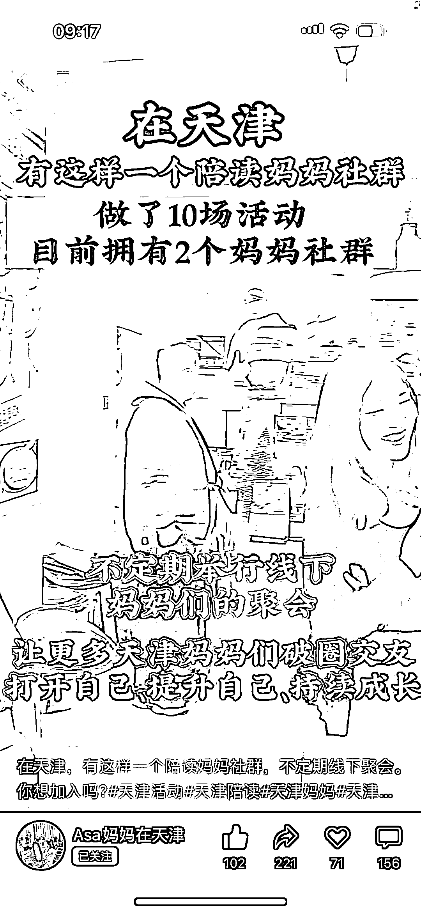
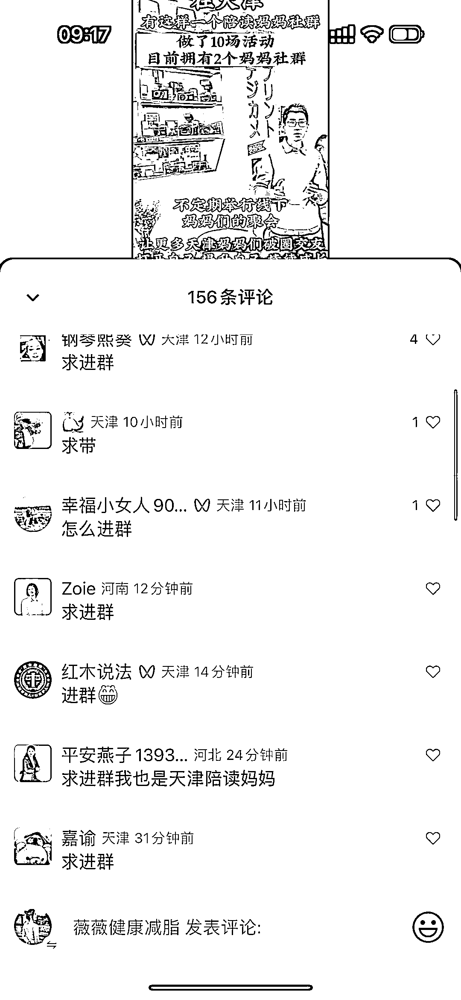
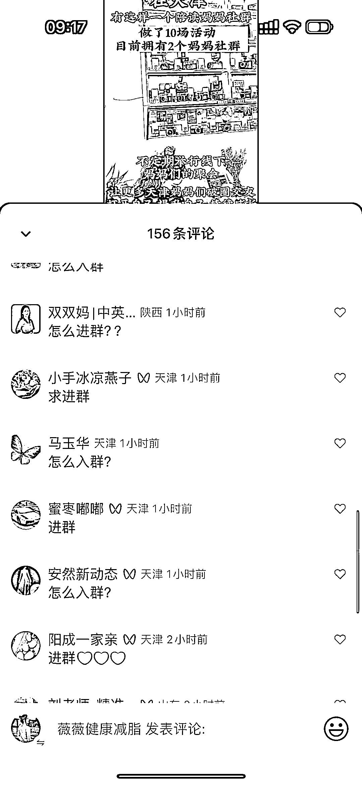
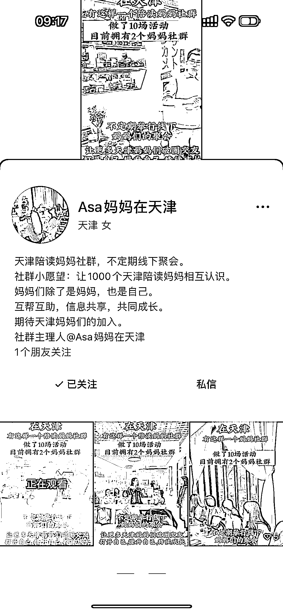

# 同城线下流量在视频号上的高转化率，天津同城陪读妈妈社群的成功案例

> 原文：[`www.yuque.com/for_lazy/xkrm14/hbn2kmbf0ie9u69c`](https://www.yuque.com/for_lazy/xkrm14/hbn2kmbf0ie9u69c)

作者： Vivi|每日成长 *

日期：2023-12-25

点赞数：**72**

* * *

正文：

同城线下流量在视频号上很容易获取，天津同城陪读妈妈的社群，发了 3 个视频，下方全都是问怎么加入，转化率非常高。
妈妈粉最值钱，后期后端可以进行各种团购、辅导课、亲子旅游游学项目。 想象空间太大了，有时间有精力的人，绝对可以一试。

* * *

评论区：

* * *

公众号懒人找资源，懒人专属群分享