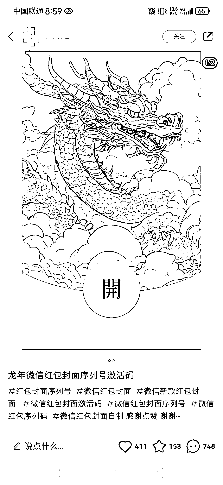
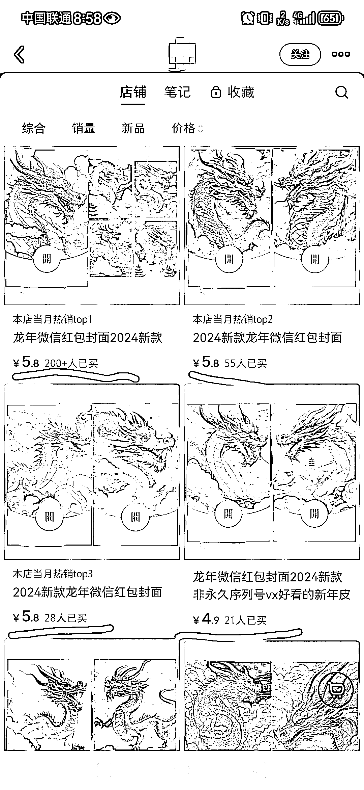

# AI 绘画龙年微信红包封面，短短 10 天涨粉 1700+，销量达 400+

> 原文：[`www.yuque.com/for_lazy/xkrm14/yv3hyl4sugg7lpz8`](https://www.yuque.com/for_lazy/xkrm14/yv3hyl4sugg7lpz8)

作者： 珞珈 Lorjia

日期：2023-12-25

点赞数：**115**

* * *

正文：

小红书店铺--AI 绘画龙年微信红包封面，不到 10 天，涨粉 1700+，红包封面销量 400+
我看这个账号是 12 月 16 号才起的小红书号，短短不到 10 天时间，涨到 1780 个粉丝，目前还在持续涨粉，评论区都是求龙年红包封面的，非常牛🐮
做法也很简单，直接用 AI 绘画生成龙年的图片，制作成红包封面就行，自己定制红包封面成本就 1 块钱 PS：定制红包封面要求个人用户视频号或者公众号达到 100 个粉丝

* * *

评论区：

* * *

公众号懒人找资源，懒人专属群分享