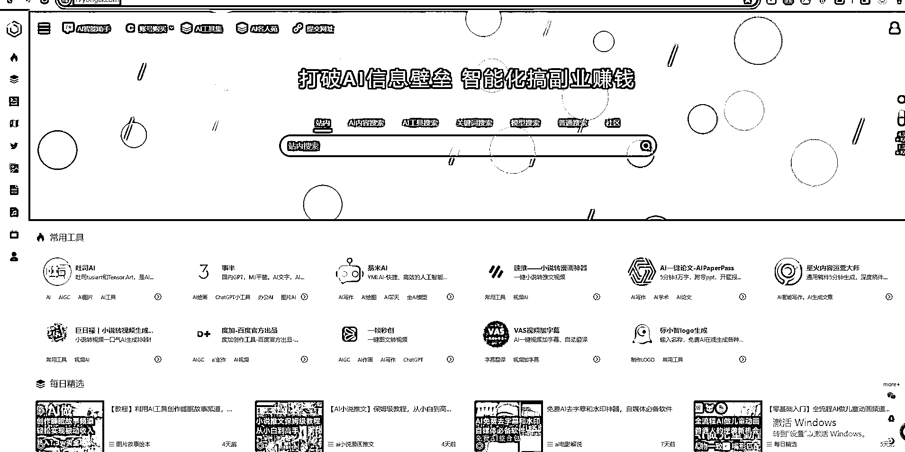
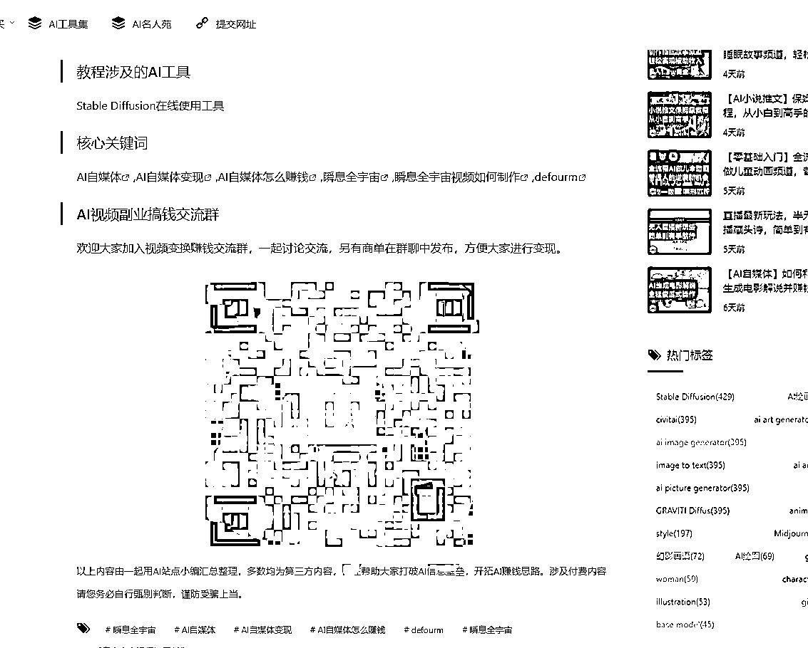
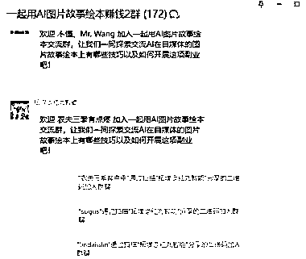

# AI 搞钱合集网站，详细教程和交流群，助你在 AI 副业中获得成功

> 原文：[`www.yuque.com/for_lazy/xkrm14/zkandlfkpte5amqs`](https://www.yuque.com/for_lazy/xkrm14/zkandlfkpte5amqs)

作者： 离心之巅

日期：2023-12-25

点赞数：**74**

* * *

正文：

ai 搞钱合集网站 项目非常丰富，每一个都有对应详细教程
并且每一个项目都建立了对应的交流群试着加了几个项目群，大部分都开到了 2~3 群，并且还在不停有人进来，数据很猛！！全是精准 ai 搞钱粉，后期转 ai 创业项目。应该很不错
学习到的点：1、互联网时代特别是 ai 时代，信息产出速度太快，然而大部分人是不具备搜索能力的，导致注意力东一块西一块。能有这样一个专业汇总网站，信息量密集，能大大提高用户搜索效率和获取信息的效率。合集思维也自带流量，比如好物合集，生活妙招合集，各类信息整合贴例如生财的各类合集。天生流量都不错，并且转发量巨大。
2、获得如此庞大精准粉丝的前提，一定要先利他。能真正为用户提供价值，用户感知到了价值，自然会有信任感。流量也会源源不断。[一起用 AI |
AI 副业搞钱套路集合站点](https://17yongai.com/)

* * *

评论区：

望天吼 : 这个链接能发一下么

离心之巅 : 网址我已经发了，点击蓝色字的部分就是网址

望天吼 : 感谢感谢[抱拳][抱拳][抱拳]

Bernie Fu : 这个思路可以复刻

* * *

公众号懒人找资源，懒人专属群分享