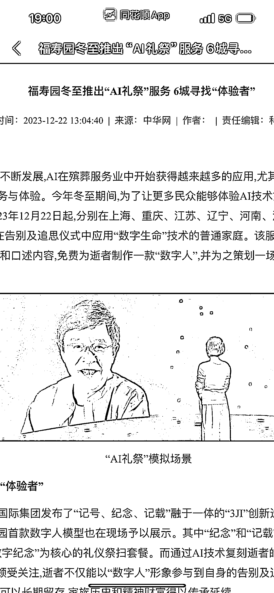

# 港股上市公司福寿园推出 AI 数字人礼祭服务，数字生命商业化得到资本认同

> 原文：[`www.yuque.com/for_lazy/xkrm14/cpgnpzioircht2cv`](https://www.yuque.com/for_lazy/xkrm14/cpgnpzioircht2cv)

作者： 高杰

日期：2023-12-27

点赞数：**59**

* * *

正文：

港股上市公司福寿园推出 ai 数字人礼祭服务，数字生命已经走进了现实，就是年初那个 b 站爆火的和去世的奶奶对话的产品化，说明现在产品的商业化已经得到资本的认同，未来类似的服务将会快速发展

* * *

评论区：

* * *

公众号懒人找资源，懒人专属群分享