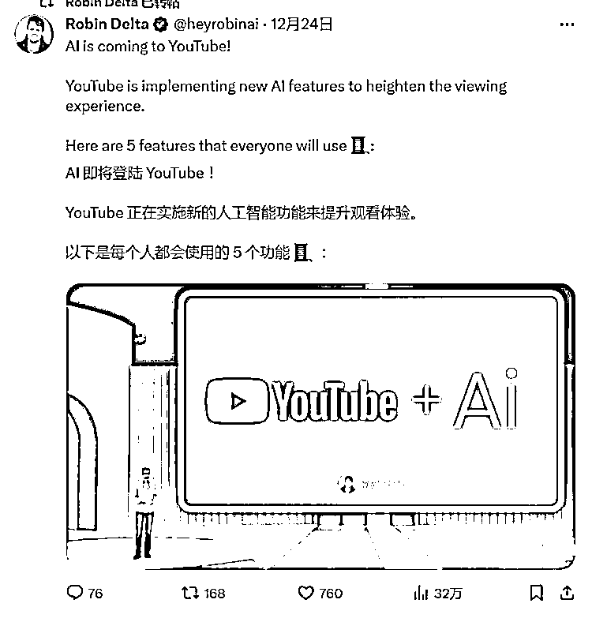

# YouTube 推出 AI 功能，提升观看体验，5 个实用功能一览

> 原文：[`www.yuque.com/for_lazy/xkrm14/tbkwlek1aispnnfd`](https://www.yuque.com/for_lazy/xkrm14/tbkwlek1aispnnfd)

作者： 深圳志哥

日期：2023-12-26

点赞数：**52**

* * *

正文：

AI 即将登陆 YouTube！ YouTube 正在实施新的人工智能功能来提升观看体验。 以下是每个人都会使用的 5 个功能。 1\. 跳过冗长的视频！
只需就任何视频内容向人工智能提问，就能立即得到答案，并在视频旁边找到有用的链接。 2\. 忘掉无休止地滚动浏览评论区吧。 现在，您可以通过 AI
的简明摘要掌握评论要点。 3\. 消除创造力和视频编辑方面的困难。 Dream Screen 可让您轻松生成视频，只需 1 个提示。 4.告别头脑风暴的挣扎
YouTube Studio 即将推出的功能将为创作者提供人工智能生成的独特见解、视频建议和音乐选项。 5\. 大幅缩短您的编辑时间。 YouTube
Create 应用程序使分割、修剪、重新排列剪辑和优化音频质量变得比以往更加简单，所有这些都只需几秒钟。

* * *

评论区：

深圳志哥 : 谢谢老大[愉快]

* * *

公众号懒人找资源，懒人专属群分享