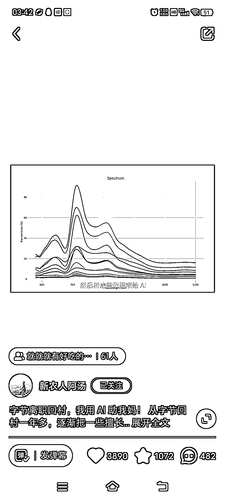
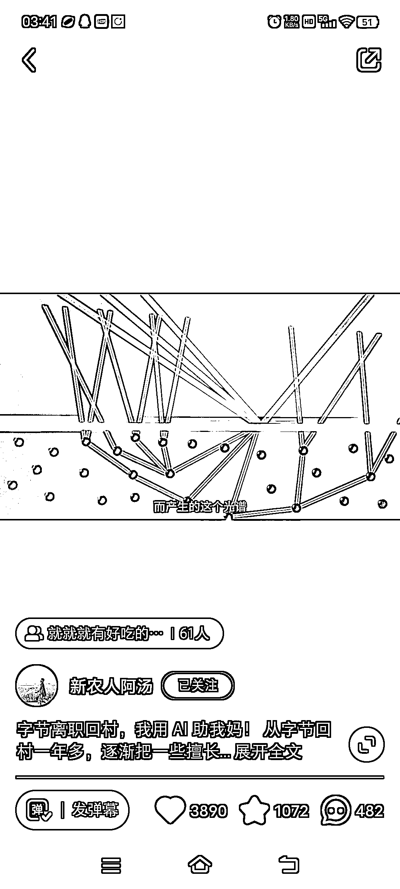
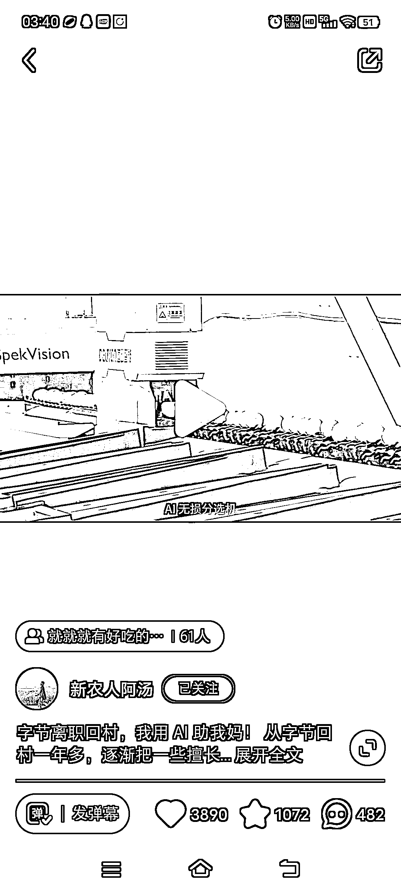
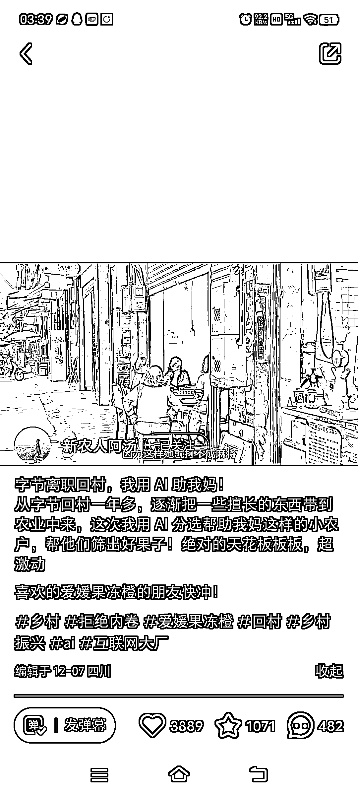

# 利用 AI 技术实现橙子甜度的无损分离

> 原文：[`www.yuque.com/for_lazy/xkrm14/rdpy9bkbwab5eqh8`](https://www.yuque.com/for_lazy/xkrm14/rdpy9bkbwab5eqh8)

作者： 文轩

日期：2023-12-28

点赞数：**59**

* * *

正文：

ai+农业 用一束光照过橙子，产生的光谱和甜度有相关性。 然后把数据喂给 ai，搞出来 ai 无损分离机。

* * *

评论区：

文轩 : 水果从非标品，变成标品，高价卖礼盒[色]

计然 : [强]

朕 : B 站首发的，转去抖音也这么火

文轩 : 这个我是在小红书找到的

* * *

公众号懒人找资源，懒人专属群分享