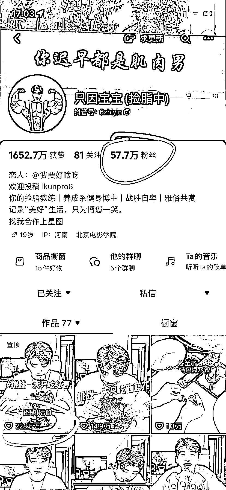
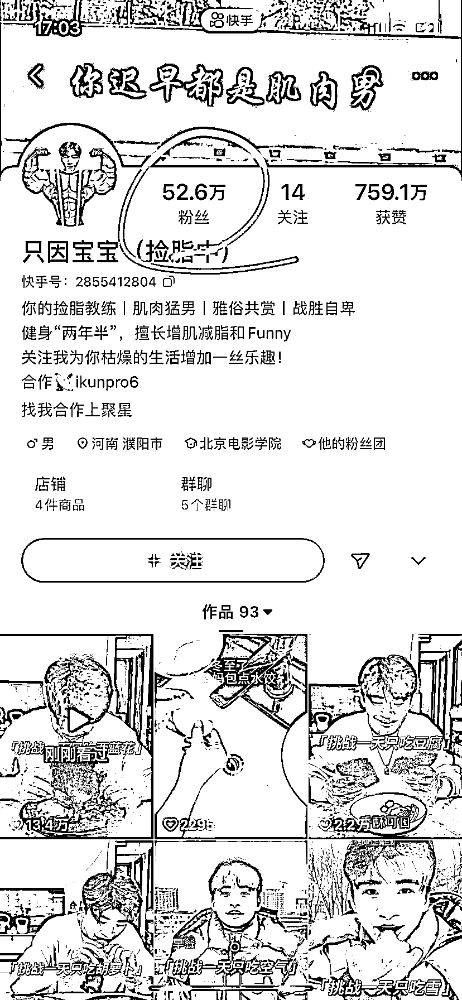
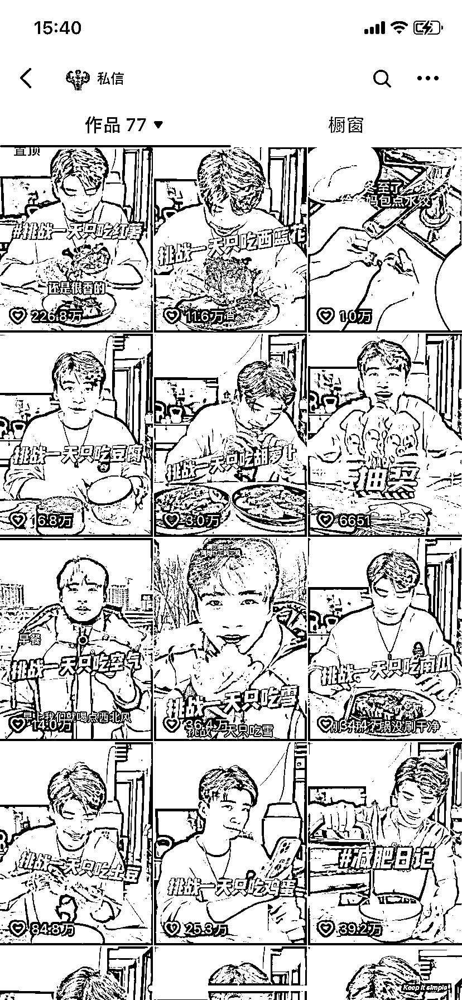

# 挑战一天只吃 XX，却吃好吃的，视频爆火的秘密揭秘

> 原文：[`www.yuque.com/for_lazy/xkrm14/cou8mb2kdrgsgar9`](https://www.yuque.com/for_lazy/xkrm14/cou8mb2kdrgsgar9)

作者： 飞掌柜

日期：2023-12-25

点赞数：**74**

* * *

正文：

【反向带货新思路】 1、该博主的工作是减脂教练，视频标题都是【挑战 1 天只吃 XX】，看似是减肥，但视频内容都是吃好吃的。
2、比如一天只吃南瓜，切南瓜切出了汉堡，空气炸锅烤南瓜结果烤出了蛋糕，美其名曰做砸了，但是观众都知道。这种高热量食物和标题反差，和健身反差，让视频爆火。
3、抖音、快手、视频号加起来百万粉丝，视频数据都很不错[强]

* * *

评论区：

飞掌柜 : 多谢老大

流量皮校长 : 确实好看，刷到过

* * *

公众号懒人找资源，懒人专属群分享