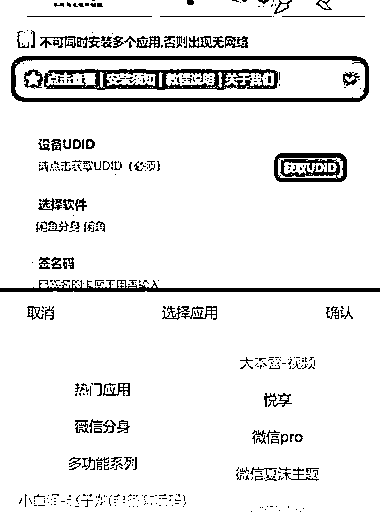
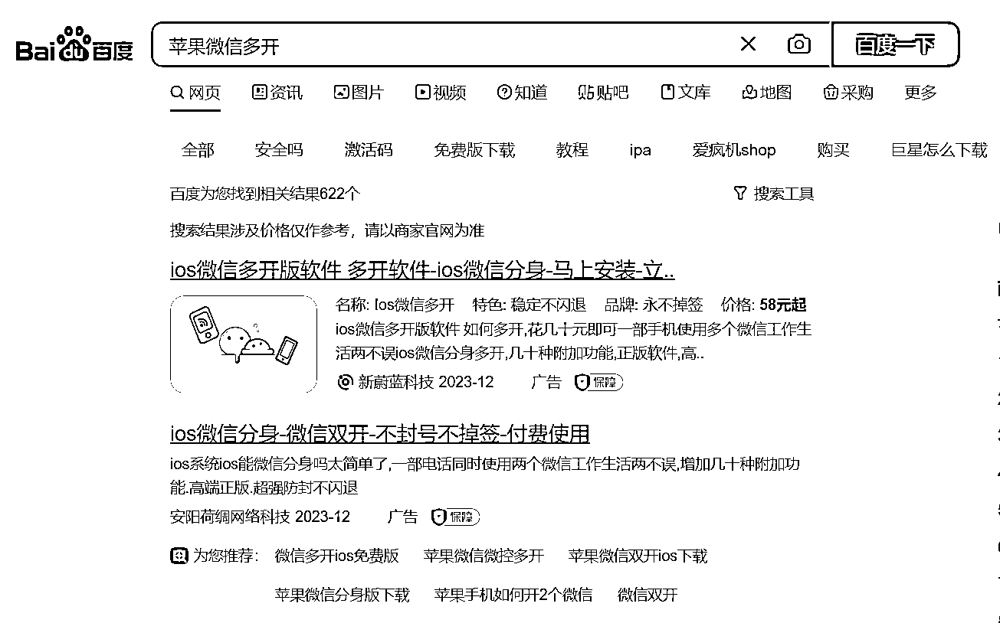

# 苹果手机用户需求旺盛，微信多开-营销定制软件市场潜力巨大

> 原文：[`www.yuque.com/for_lazy/xkrm14/ct5vi6ugablodhtt`](https://www.yuque.com/for_lazy/xkrm14/ct5vi6ugablodhtt)

作者： Jeffrey Li*

日期：2023-12-25

点赞数：**70**

* * *

正文：

身边一个卖微信多开/营销定制软件的朋友，每月利润 2w+，只要是苹果手机，那就会有需求，大部分人都有需求且愿意付费，这个在百度也有大量的广告在投放，投流的客单均价在 100 左右。

* * *

评论区：

酱油 : 怎么搞[微笑]

望天吼 : 挖金的还在卷，卖水的赚的盆满钵满啦[呲牙]

银老板 : 这个需求一直都很强[强]

青山 : 苹果多开叫什么名字呢

没什么可说的 : 苹果微信多开都不敢整 封怕了 只敢用系统自带多开

布道者 : 对

快乐柠檬 : iPhone 有自带多开吗？

* * *

公众号懒人找资源，懒人专属群分享