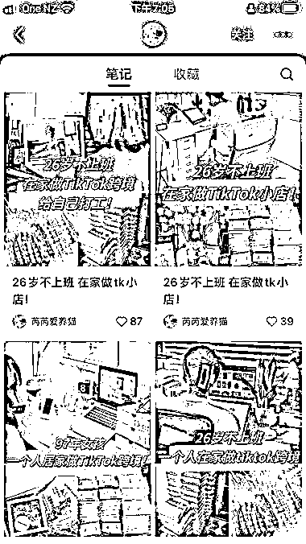
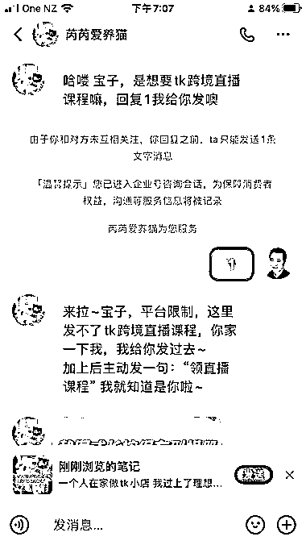
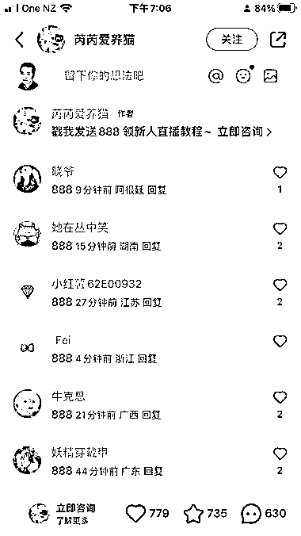

# 26 岁创业者成功吸引精准副业人群，评论区求带热潮涌现

> 原文：[`www.yuque.com/for_lazy/xkrm14/cwmvgqhe9z0eh53k`](https://www.yuque.com/for_lazy/xkrm14/cwmvgqhe9z0eh53k)

作者： 新西兰 Michael

日期：2023-12-26

点赞数：**73**

* * *

正文：

26 岁不上班，一人公司，出海 TK，吸引的都是精准想要搞副业的人群，评论区全都是求带的。
小红书是企业号，通过扫描二维码加引流到微信企业号，看直播，这个引流方式和转化很 6。

* * *

评论区：

千幻 : 这种应该是给人导流的,或者是员工...那么在意有没有加过去- -

田新一 : 怎么做到不违规不封号的呢

雅士哥哥 : 这个好像是咱们圈友公司的一个员工号😂

* * *

公众号懒人找资源，懒人专属群分享