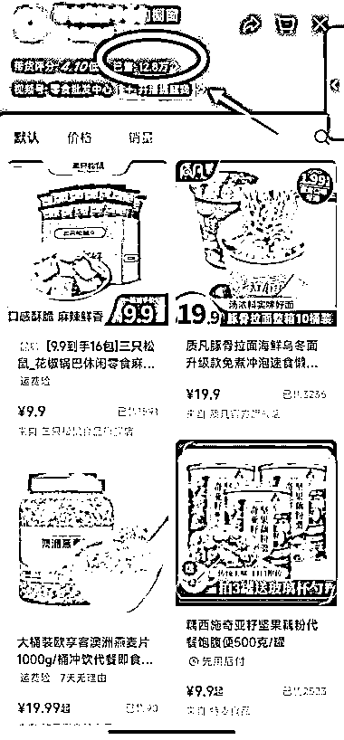

# 直播临期食品吸引 2 万人观看，销量达 12.8 万

> 原文：[`www.yuque.com/for_lazy/xkrm14/wvlewa0vlmsget7g`](https://www.yuque.com/for_lazy/xkrm14/wvlewa0vlmsget7g)

作者： 徐 Ken

日期：2023-12-25

点赞数：**60**

* * *

正文：

直播临期食品，2 万人场观，销量 12.8 万。
在视频号刷到一个临期食品的直播间（如图一），竟然有 2 万人的场观，而且评论区不断有人咨询是否有甄柿冰淇淋、西梅干等产品，可见需求真的很大。然后看了一下橱窗，销量竟然达到 12.8 万（如图二）。
这画面让我非常有感触，想起 6 月份到一个高校找朋友，遇到一个老板带着两个兼职员工在摆摊卖临期食品，用一辆中型货车拉过来一车的货。有两个点非常重要：（1）专挑周末进行摆摊，因为学生有空买东西。（2）摊位放在学生公寓的必经之路上，只要有部分学生聚拢过来，就会产生从众效应，吸引更多的学生过来。一天能销售 6 千到 8 千的销售额。摊位只有 10 平米左右，租金竟然高达 1500 一天，两个兼职员工一天工资一共 600。没有问到利润率，租金这么高都租下来，而且从老板一脸笑容的状况看，说明利润应该不错。有兴趣的圈友可以去实操一下。

* * *

评论区：

爱拼才会赢 : 但是货源咋搞呢

徐 Ken : 1\. 线上: 搜“临期食品” 2.线下:去高校看看？ 我没做过，不太确定这些方式是否可行😂

徐 Ken : 多谢亦仁大大

雅士哥哥 : 这个号已经做了快 2 年了

徐 Ken : 那说明有利可图，更有入局参战的必要了😂

Tony : 临期食品要一线品牌比较好卖

徐 Ken : 有道理。Tony 做过？

* * *

公众号懒人找资源，懒人专属群分享