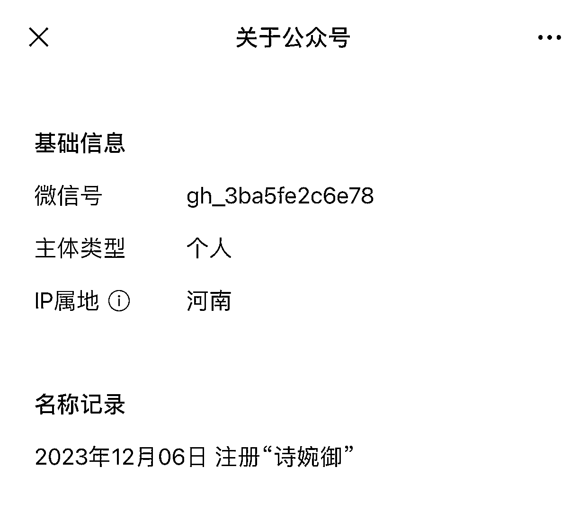
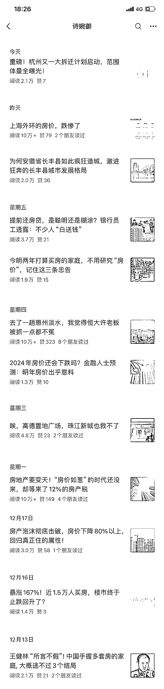

# 一个月内 11 篇爆款！房地产公众号揭秘业主关注的难点痛点

> 原文：[`www.yuque.com/for_lazy/xkrm14/ksbq8mh4bmoemdzs`](https://www.yuque.com/for_lazy/xkrm14/ksbq8mh4bmoemdzs)

作者： 林林 AIGC 写作

日期：2023-12-25

点赞数：**54**

* * *

正文：

12 月 6 日才开通的一个公众号，不到一个月时间出现了 11 篇爆款。
选题关注的都是房地产行业的热点事件，当然了，具体的视角都是围绕业主们普遍关注的难点痛点展开的。
看来在地产行业有所深耕的圈友，也不妨开个公众号讲讲近年来地产行业的那些事儿，以流量主的方式变现。

* * *

评论区：

能量菌 : 房地产和职场只要能抓到需求还是可以的

… : 这么多还不如东方甄选一篇多，我见一个大佬东方甄选直接跑了大几十万的阅读

林林 AIGC 写作 : 天啊

林林 AIGC 写作 : 你看看我最新发的这条：[`t.zsxq.com/15VjcNdCK`](https://t.zsxq.com/15VjcNdCK)

* * *

公众号懒人找资源，懒人专属群分享