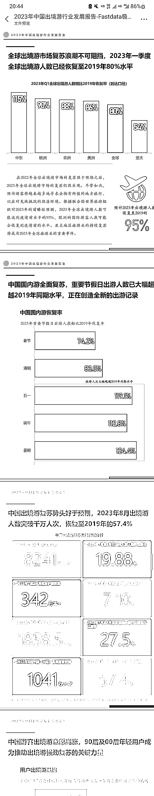

# 2023 年中国出境行业发展报告：疫情后旅游行业复苏井喷式增长

> 原文：[`www.yuque.com/for_lazy/xkrm14/am12azgghd1c9t57`](https://www.yuque.com/for_lazy/xkrm14/am12azgghd1c9t57)

作者： 是十三幺啊

日期：2023-12-25

点赞数：**44**

* * *

正文：

来自极数的 2023 年中国出境行业发展报告 数据层面有效展示了疫情后的旅游行业复苏效应和井喷式增长呈现 大行业的发展是行业风向
落到我们个人身上，可以重视关注一波国内出境游

* * *

评论区：

better me : 您好 谢谢分享 这个🈶原文档或者链接吗？可以发出来让大家一起学习一下吗？谢谢啦

是十三幺啊 : 好的

better me : 谢谢你了🙏

是十三幺啊 : [爱心]

是十三幺啊 : [`lo4iun4e97.feishu.cn/file/KcaMbBiXqoZ8RDxd...`](https://lo4iun4e97.feishu.cn/file/KcaMbBiXqoZ8RDxdAShch8btnpc) 

* * *

公众号懒人找资源，懒人专属群分享