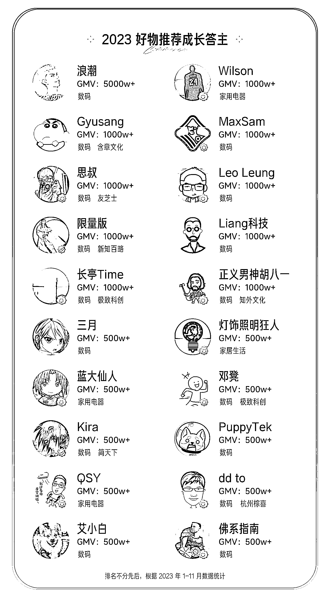

# 2023 年行业标杆出炉，知乎好物仍有坚持者吗？

> 原文：[`www.yuque.com/for_lazy/xkrm14/ueb88m5q0vvmh0a2`](https://www.yuque.com/for_lazy/xkrm14/ueb88m5q0vvmh0a2)

作者： 辉哥

日期：2023-12-26

点赞数：**36**

* * *

正文：

坚持做知乎好物的还有吗？2023 年行业标杆出来了

* * *

评论区：

老七 : 我还在做，一个月可怜不到 1000 块了[流泪]你说尴尬不尴尬

辉哥 : 一个月 1000 好物而已，其实挺多了。前段时间问了一圈，之前做好物的很多人都不做了。即使还在做的，也都是靠收广告费，而不是靠带货赚佣金的模式。
现在知乎带货的大盘整体还在下降，暂时没有碰到做的非常大的团队

老七 : 是的，不可逆下滑。 我其实还是挺喜欢这种长期项目的，再没发现好的类似项目

辉哥 : 我们现在每个月整体还有增长！可以坚持做下去的，合适才是最重要的

老七 : 厉害了，这种环境下

骷比絨 : 请教下，知乎好物赛道比之前难做的原因是什么？

九 : 知乎流量不行了

* * *

公众号懒人找资源，懒人专属群分享