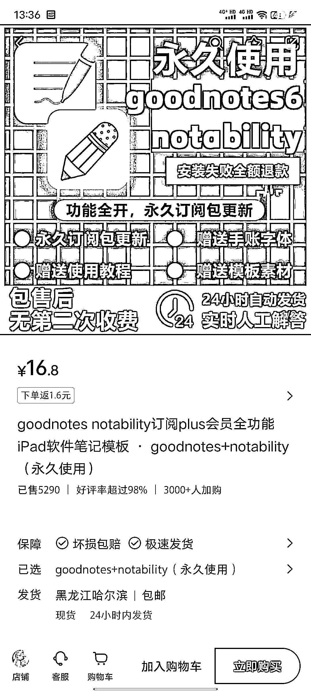
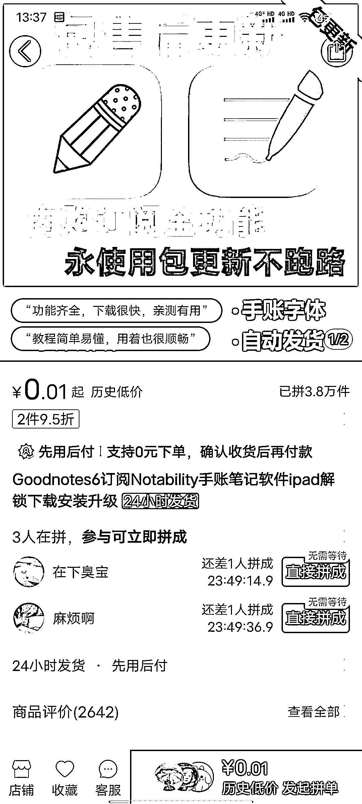

# 小红书店铺搬运拼多多教程，零成本高利润

> 原文：[`www.yuque.com/for_lazy/xkrm14/vykghz54n6ypmq6a`](https://www.yuque.com/for_lazy/xkrm14/vykghz54n6ypmq6a)

作者： 学海

日期：2023-12-29

点赞数：**89**

* * *

正文：

小红书店铺卖 GoodNotes 等软件。 其实就是直接搬运拼多多的教程。 一本万利，几乎零成本。 也可以扩展到其他虚拟类产品

* * *

评论区：

学海 : 第一次 get✔️

波哥 : 请教一下， 小红书店铺怎么卖虚拟产品， 他这个是放在哪个类目下的呢？

学海 : 去试着上架了，自然就知道

* * *

公众号搜索，懒人专属群分享