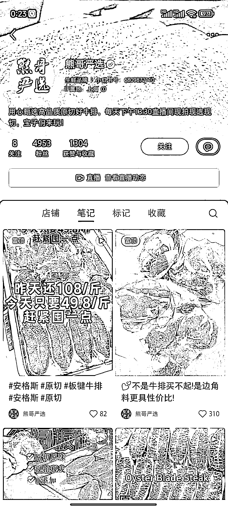
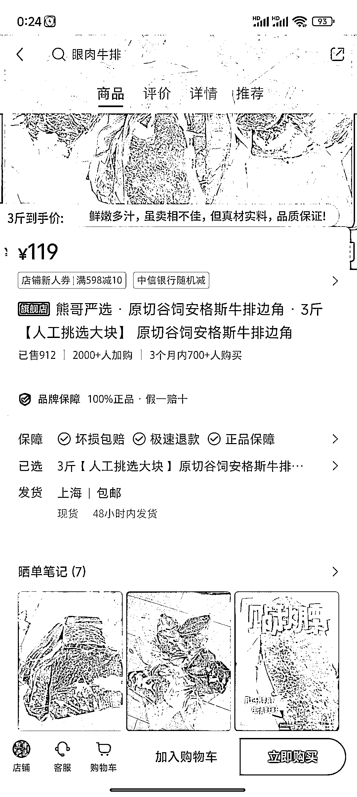
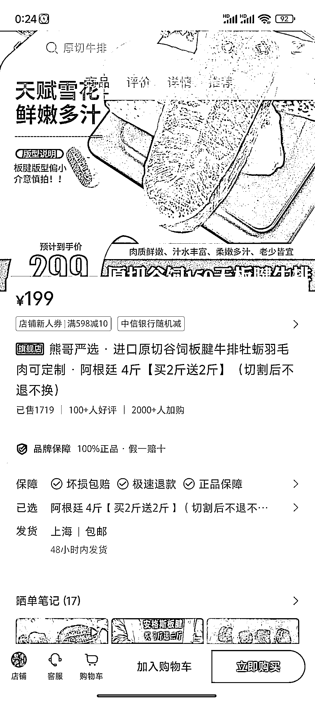

# 小红书垂直号，2 个月粉丝 4950，边角料牛排已售 912 单，原切牛排已售 1700 单

> 原文：[`www.yuque.com/for_lazy/xkrm14/mgzwm71ab4hwfrob`](https://www.yuque.com/for_lazy/xkrm14/mgzwm71ab4hwfrob)

作者： 发达

日期：2024-01-03

点赞数：**43**

* * *

正文：

小红书垂直号，卖边角料牛排+进口原切牛排，账号创立 2 个月，粉丝 4950。 边角料牛排单价 119 元，已售 912 单，原切牛排 199 元，已售 1700 单。

* * *

评论区：

Eden : 对方是自己的供应链

* * *

公众号搜索，懒人专属群分享