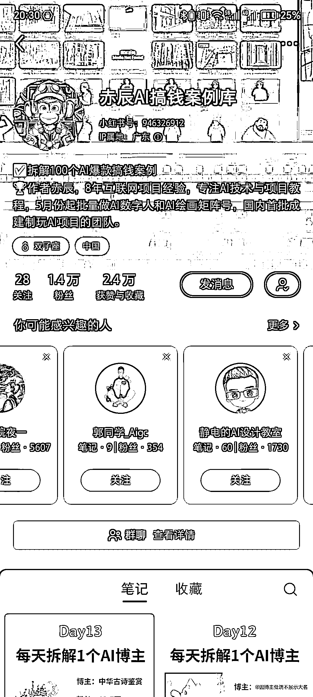
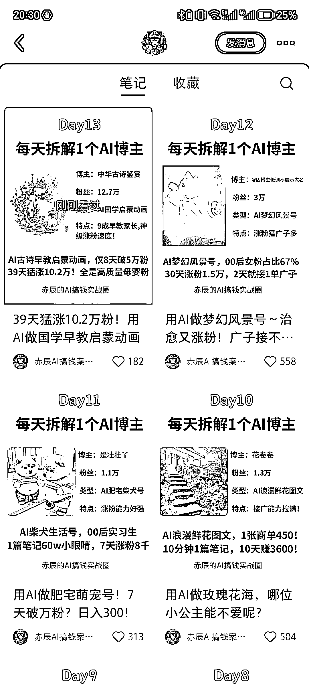

# 小红书 AI 博主案例拆解

> 原文：[`www.yuque.com/for_lazy/xkrm14/uy3gkxonxid8g35o`](https://www.yuque.com/for_lazy/xkrm14/uy3gkxonxid8g35o)

作者： 鹊起老宋

日期：2024-01-04

点赞数：**42**

* * *

正文：

小红书 AI 搞钱案例库拆解，每天拆解一个 Ai 博主，18 个笔记，1.4 万粉，2.4 万赞，做 AI 的可以模仿下。

* * *

评论区：

鹊起老宋 : 谢谢亦仁大大。

月 : 这个不错，拆解 IP 作为内容

鹊起老宋 : 其他的也同理

月 : 是的[奸笑]

聂叔 : 号没了[流泪]

melisa : 号没有了。咋回事？

鹊起老宋 : 啥情况

* * *

公众号搜索，懒人专属群分享