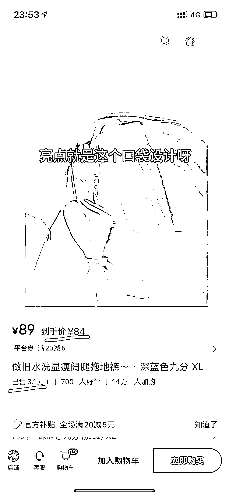
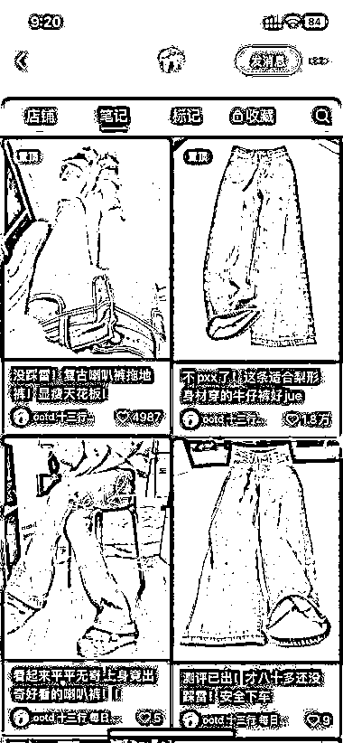
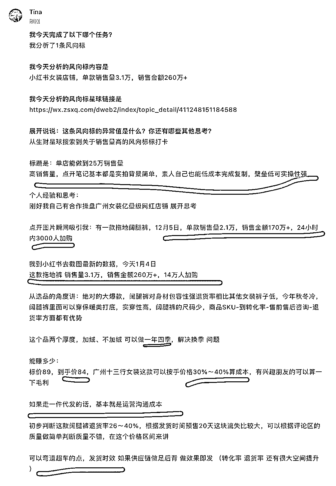

# 小红书女装爆款，销量 3.1 万，单品利润超百万！

> 原文：[`www.yuque.com/for_lazy/xkrm14/sdzt6tt3pt83byew`](https://www.yuque.com/for_lazy/xkrm14/sdzt6tt3pt83byew)

作者： Tina

日期：2024-01-05

点赞数：**49**

* * *

正文：

小红书女装爆款 单款销量 3.1 万，单价 84，销售额 260 万+ ，单品利润超百万！笔记基本是简单背景实拍图，素人都可以低成本快速复制 产品本身有优势（见图三）
有快速放大的空间 利润 销售量 等（图三）

* * *

评论区：

Tina : 今天学习风向标挖掘第一课，自己边学习边实践 输入-结合个人经验输出分享-思考的过程给到自己很多新启发 也希望分享给对账户行业感兴趣的圈友参考

* * *

公众号搜索，懒人专属群分享