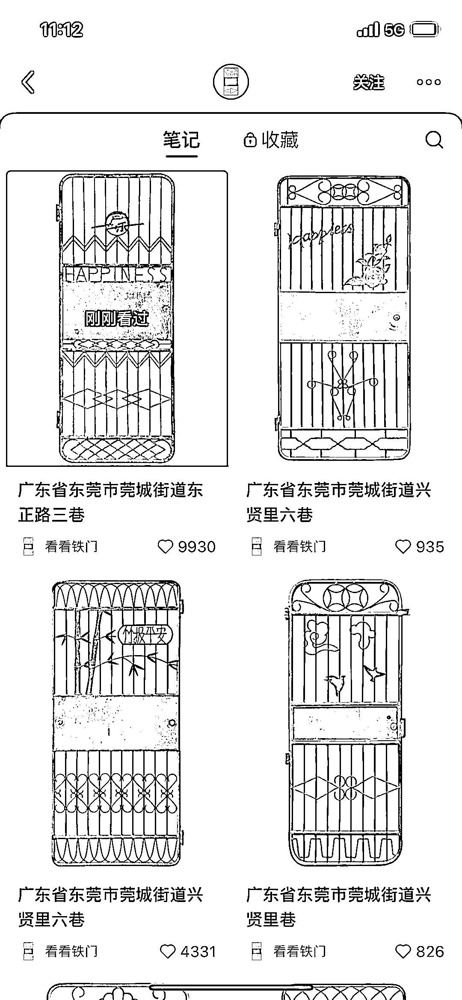
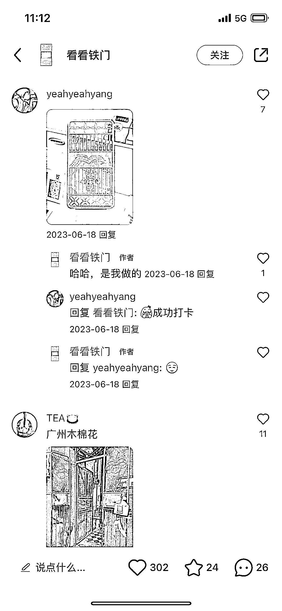
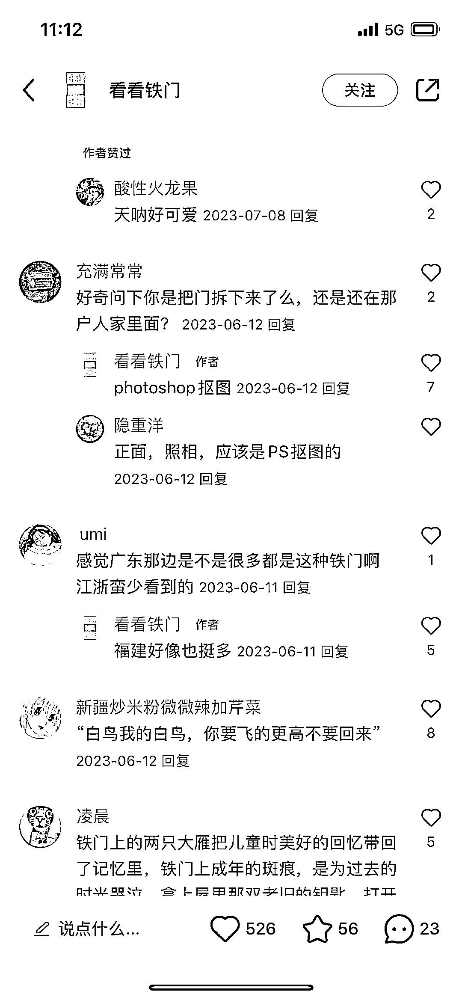
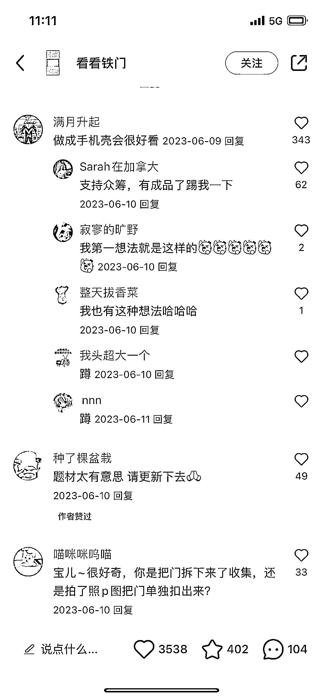
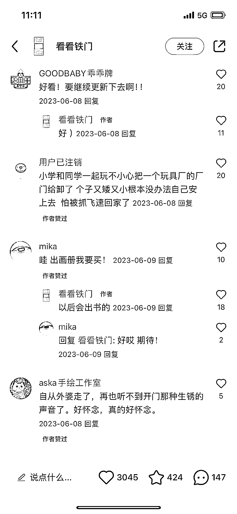
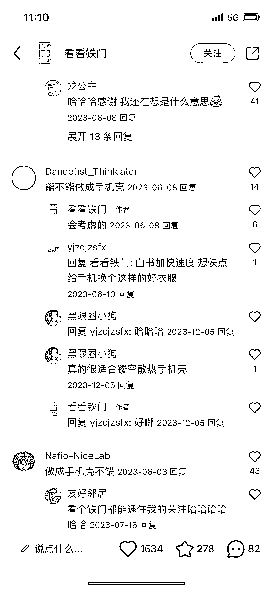

# 小红书号“看看铁门”引发用户怀旧情绪，成为风向标

> 原文：[`www.yuque.com/for_lazy/xkrm14/dhsnfh173iib9463`](https://www.yuque.com/for_lazy/xkrm14/dhsnfh173iib9463)

作者： _Navia

日期：2024-01-05

点赞数：**41**

* * *

正文：

一个叫做：看看铁门，主页都是广东东莞铁门的小红书号。居然有 5.9 万粉丝，每条笔记下的赞藏和评论数据都很不错。
铁门的拍摄和抠图这个工作量不大，也能就地取材。数据好更多的是引发了很有用户对于小时候居住在铁门后的生活的怀念和共鸣。
有人觉得很好看，题材很新颖，还催更呢。有人提议说做成手机壳或者画册。目前评论区也有晒单买到了他家的铁门手机壳。
目前用户消费更多倾向于为感受和体验买单。从铁门可以引申出以曾经的老物件为题材，做一系列现代产品，让老物件的情怀寄托于新产品上。就会有一大批人为此买单。
当然，这也是一个和用户共创的过程，如果起初没有太多思路，可以从评论区里找找用户需求。

* * *

评论区：

林林 AIGC 写作 : 我也刷到了，但是不知道如何拆解，很感谢你的分享和示范，祝顺利[呲牙][呲牙][呲牙]

_Navia : 哈哈谢谢呀！同祝顺利。

林林 AIGC 写作 : 她 bio 里的小号有发自己定制的铁门书立，评论区很多求购的

南极没有北极熊 : 好有意思的选题

_Navia : 啊之前还没看到！这个书架是真有意思，又很实用

* * *

公众号搜索，懒人专属群分享