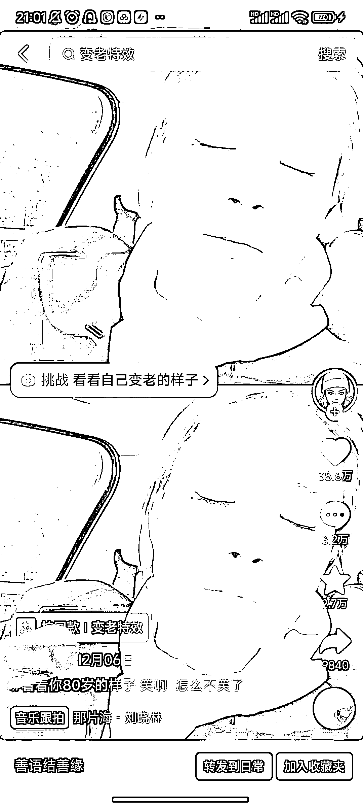
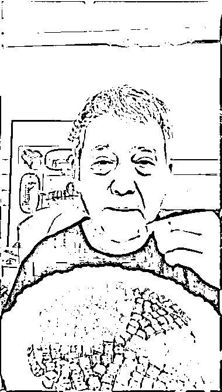
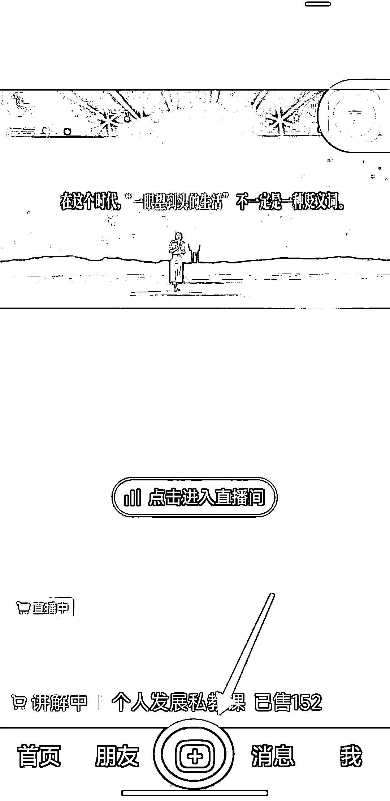

# 老人特效视频：流量不错，带货效果佳

> 原文：[`www.yuque.com/for_lazy/xkrm14/rsg8bfgd4zb014mm`](https://www.yuque.com/for_lazy/xkrm14/rsg8bfgd4zb014mm)

作者： 徐 Ken

日期：2023-12-29

点赞数：**76**

* * *

正文：

用老人特效做视频，流量非常不错，带货效果也很好。
在抖音和视频号刷到不少老人特效的视频，播放量都还不错（如图一）。部分视频用来带货（如图二），一个月有一百多万的 GMV，甚至用特效直播带货，原因之一是观众看到老人不在家享受天伦之乐，还这么努力进行带货，产生怜悯之心，进而付费带货支持。老人特效视频的制作流程如下：
（1）打开抖音，点击底部的“+”号，如图三所示。 （2）点击“视频”，再点击左下角的“特效”，如图四所示。 （3）点击右下角的放大镜，如图五所示。
（4）搜索“老了”特效，通常选择前两种，如图六所示。然后开始拍摄即可。

* * *

评论区：

每天晒白牙 : 如果要说话，声音也得处理下

徐 Ken : 这句话暴露出你做过。高手分享一下心得，让我们学习一下-*--*-

每天晒白牙 : 我没有，我是想知道😂

徐 Ken : 剪映，声音变速😂

每天晒白牙 : 看吧，你才是高手

徐 Ken : 😭

波叔 : 这个市场非常大

徐 Ken : 抖音里闷声发大财的例子，太让人出乎意料了[呲牙]

* * *

公众号搜索，懒人专属群分享