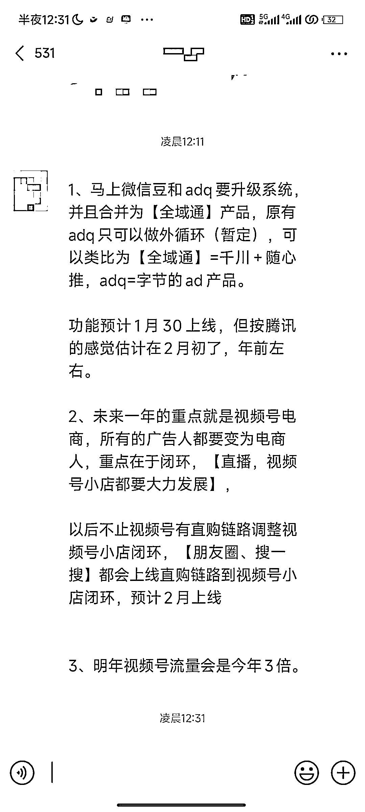
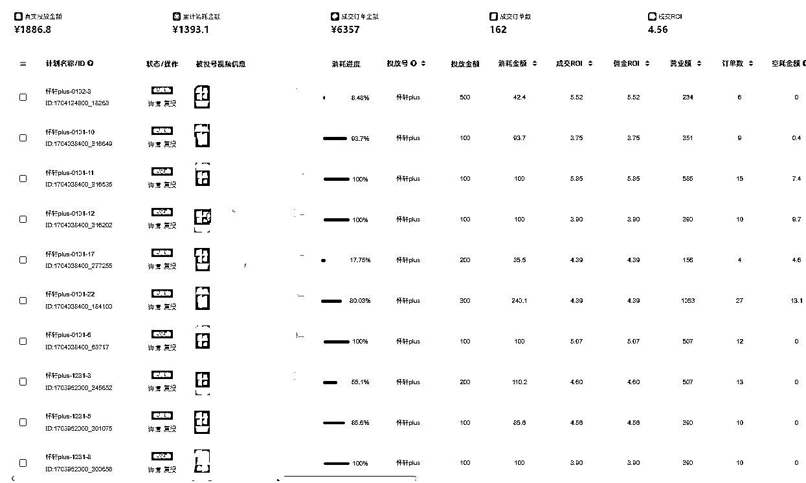
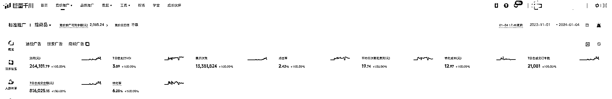

# 视频号电商即将升级，带来巨大机会

> 原文：[`www.yuque.com/for_lazy/xkrm14/fpykzt8fynn7wfbi`](https://www.yuque.com/for_lazy/xkrm14/fpykzt8fynn7wfbi)

作者： 怀轩

日期：2024-01-04

点赞数：**40**

* * *

正文：

百万电商人期待的「视频号版巨量千川」即将上线？
视频号加热平台即将与 ADQ（腾讯广告投放平台）合并升级为「全域通」产品，视频号电商的付费红利在今年或许要全面释放了，时间不一定是在年前，但应该不会太遥远。
这次平台的升级，会带来多大的机会？ 上个月，我们把在千川跑得不错的爆款产品和素材，1 比 1 迁移到视频号去测试了后，得出了以下三个结论：
1、视频号小店的退款率是抖店的 1/3 2、视频号加热平台的 ROI 比千川高 50%左右 3、视频号付费撬动的自然流 GMV 是抖音的 3 倍左右。
但现在的视频号加热平台依旧存在 1 个很大的痛点：不能稳定放大。 比如：
1、只能一笔一笔投，相当于只有抖音的随心推，就算堆一样的广告计划，因为建模数据不一样，效果也会差很远，整体 ROI 就会被拉下来。
2、不能直接给数据好的投放订单（P2）加预算，也无法在加热过程中调整竞价。 导致付费效果不稳定，无法被快速放大。
但如果视频号能有像千川这样更成熟更可控一点广告投放平台，问题就能迎刃而解了。 跟三个月后的视频号广告投放系统比起来，现在的微信豆只是过家家。
千川的一条广告计划可以消耗 10w 甚至是 100w，也就是说，只有产品和素材 OK，投放效果可以快速放大 100 甚至是 1000 倍。 这个时候才能真正实现涛哥说过的：
「只要投不死，就往死里投」 巨量千川在抖音正式上线的时间是：21 年 4 月份。 这信息的含金量，相信做过抖音电商和视频号电商的小伙伴都懂，让我们拭目以待。

* * *

评论区：

* * *

公众号搜索，懒人专属群分享