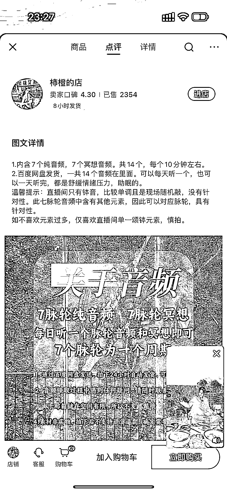
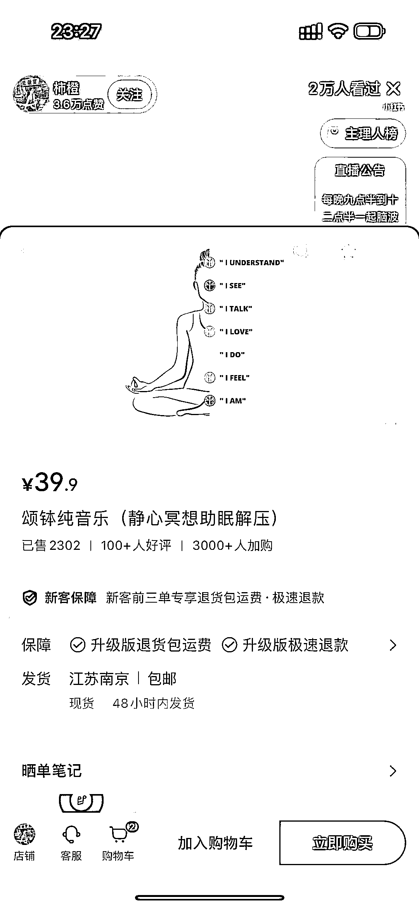

# 普通人也能做的疗愈音乐赛道，出了 2000 多单

> 原文：[`www.yuque.com/for_lazy/xkrm14/pbg29oqc0ep2vefp`](https://www.yuque.com/for_lazy/xkrm14/pbg29oqc0ep2vefp)

作者： 安迪

日期：2024-01-03

点赞数：**72**

* * *

正文：

疗愈赛道，卖疗愈音乐，出了 2000 多单，普通人也能做。

* * *

评论区：

奈斯儿 : 这个音乐是不是要去拿授权呢

安迪 : 没有深入了解哈，感兴趣可以深入研究一下。如果用别人的版权音乐，肯定会遇到问题。我以前有看到过有人会拿着设备去大自然自己录一些自然的声音：虫鸣鸟叫、流水等。不知道这个能不能解决问题。

波叔 : 焦虑者在这方面的需求还是比较大

安迪 : 是的[呲牙]主打陪伴付费

羊 : 音频换成自己的声音，录一些疗愈类型的文字，是不是也可行呢[疑问]

* * *

公众号搜索，懒人专属群分享