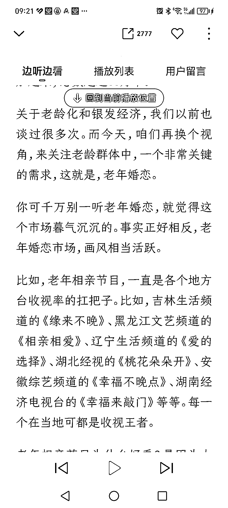
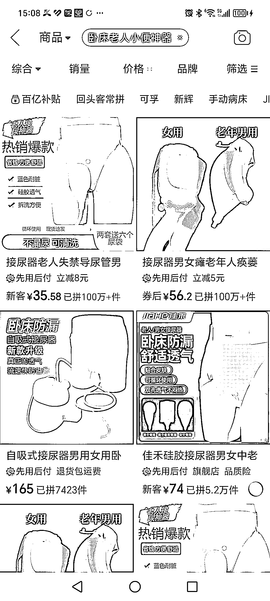

# 中国银发经济崛起，老年用品市场潜力巨大

> 原文：[`www.yuque.com/for_lazy/xkrm14/tn8h2obfig2pxcz5`](https://www.yuque.com/for_lazy/xkrm14/tn8h2obfig2pxcz5)

作者： 远方

日期：2024-01-03

点赞数：**69**

* * *

正文：

随着中国人口老龄化程度的持续加大，
银发经济老年用品市场真的广阔。看了一篇报告，老年相亲节目竟然是一些地方电视台的收视率王者。另外，网上搜了一下卧床老年用品，某单品销量更是让人咋舍。另外，据直播平台数据和做直播的群友反馈，只要和中老年相关的直播间，无论是情感聊天还是直播带货，场观最好的的时段竟然是早上四点到早九点。

* * *

评论区：

林林 AIGC 写作 : 很多厂家做这类产品做了很多年了，22 年在一次跨境电商展会上就接触到做这类产品的商家，做了很多年日本的业务。

波叔 : 老年人的刚需产品还是很多，有些是自己买，有些是娃儿给家里老人买

远方 : 日本深度老龄化，老年服务业印象最深的是七八年前就看到有专门上门给行动不便的老年人洗澡业务，大为惊叹。

阿杜 : 老人赛道产品，可以到电商平台去挖掘，也可以从老龄化严重国家去挖掘，。有的东西国内电商卖的好，你不一定知道。有的产品国外很普遍，国内才刚刚开始。

远方 : 是的，这个思维其实可以运用到任何商业模式。

* * *

公众号搜索，懒人专属群分享