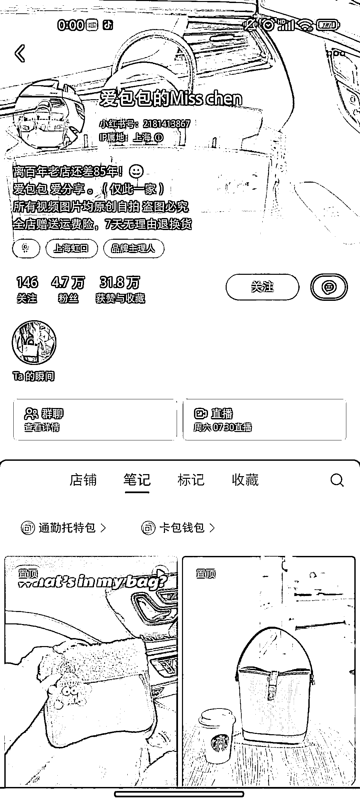
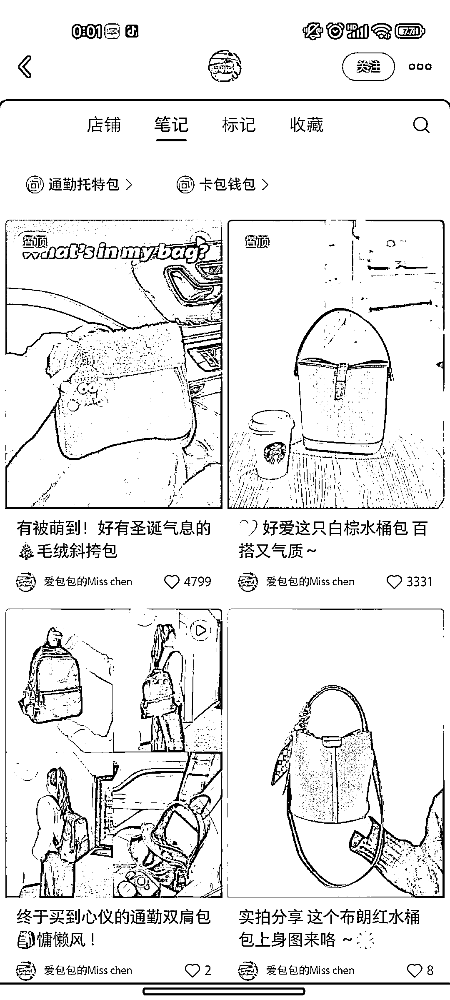
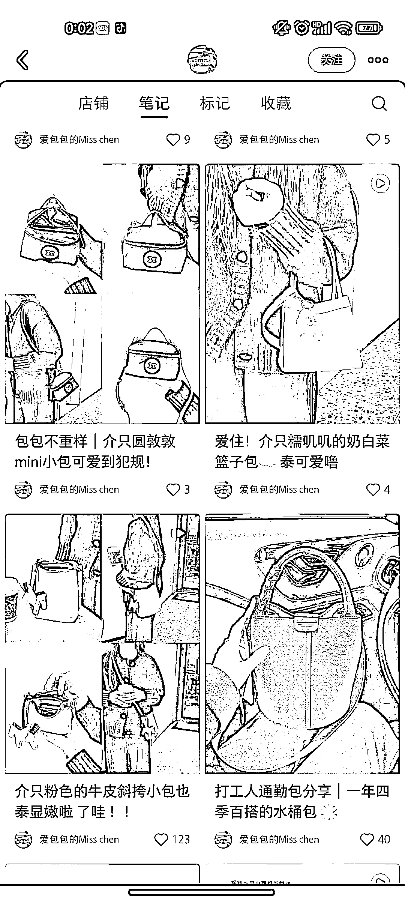
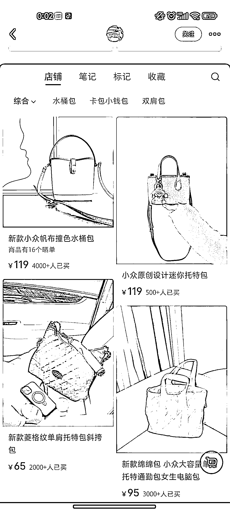
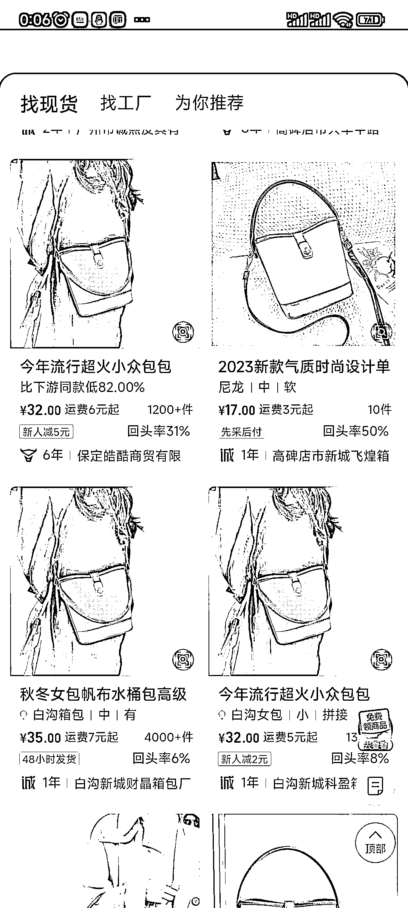

# 小众包包博主销量高，利润可观

> 原文：[`www.yuque.com/for_lazy/xkrm14/ufkwrpkh1qq1fwg8`](https://www.yuque.com/for_lazy/xkrm14/ufkwrpkh1qq1fwg8)

作者： 阿祖

日期：2024-01-04

点赞数：**55**

* * *

正文：

这种做小众包包的博主，粉丝量不高，笔记也只是简单的实物拍照，但是销量却很好，基本都是几千的销量，粗略估计几十万的利润。1688 上的进货价都很便宜，

* * *

评论区：

林林 AIGC 写作 : 直接上包牛牛更便宜，这个号胜在起好早，就是去年三四月小红书电商刚开始的时候就经常的😂

泊一 : 但是质量是真的差

阿祖 : 谢谢亦仁老大

* * *

公众号搜索，懒人专属群分享