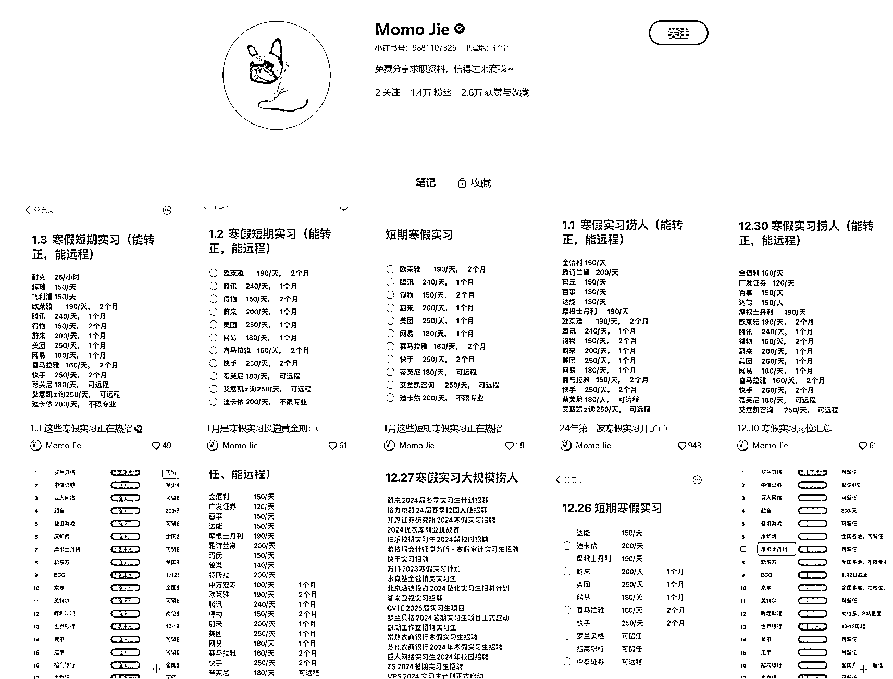
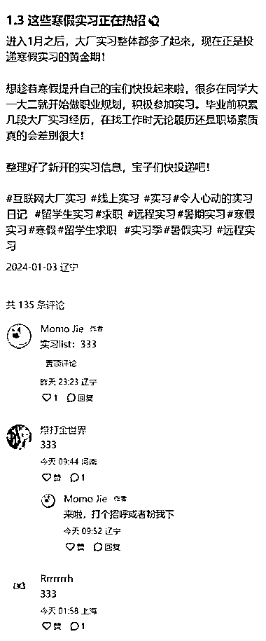

# 寒假实习机会汇聚，多家知名企业提供丰富岗位和薪资待遇

> 原文：[`www.yuque.com/for_lazy/xkrm14/ho0u4tsw5hrwbnk0`](https://www.yuque.com/for_lazy/xkrm14/ho0u4tsw5hrwbnk0)

作者： 仙蒂瑞珏

日期：2024-01-04

点赞数：**52**

* * *

正文：

寒假快到了，一大群大学生可以去实习了。 这个小红书账号名为“Momo
Jie”，提供的信息主要是关于寒假实习岗位的汇聚，这些岗位涵盖了多个行业和公司，如腾讯、欧莱雅、耐克、雅诗兰黛等知名企业。
这个账号可以被视为一个实习机会的聚合平台，通过提供多样化的实习机会和薪资信息，为学生和求职者提供了一个了解市场薪资水平和实习机会的平台，从而帮助他们根据自己的需求和目标选择合适的实习岗位。它为寻找实习机会的学生和求职者提供了一个集中的信息源。这些实习岗位不仅提供了工作经验，还可能伴随着一定的日薪或小时工资，这对于学生和求职者来说是一个额外的收入来源。
账号中的信息显示，实习岗位的薪资范围从 25 元人民币/小时（耐克）到 250 元人民币/天（快手）不等，这表明不同公司和岗位的薪资待遇存在较大差异。此外，一些岗位还提供了远程工作的机会，这对于那些希望在寒假期间工作但又不想离开家的学生来说是一个吸引人的选项。
这个账号的发布内容还强调了 1 月份是寒假实习投递的黄金期，这可能是基于招聘周期和学生放假时间的考虑。同时，账号还提到了一些实习岗位可能会有转正的机会，这对于希望在毕业后直接就业的学生来说是一个潜在的吸引力。

* * *

评论区：

A Jana : 这些实习信息是通过什么途径找出来的？

* * *

公众号搜索，懒人专属群分享