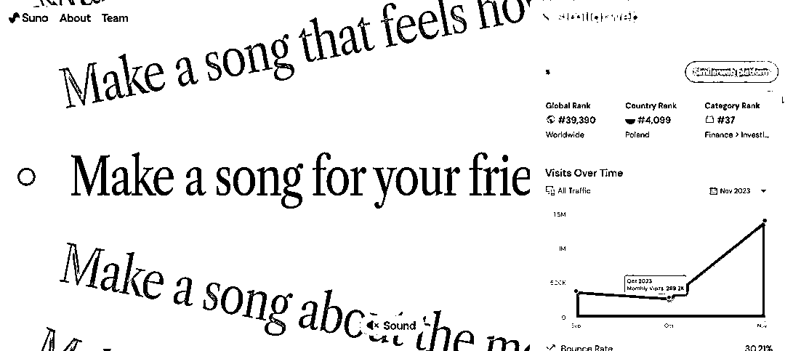

# AI Song Maker：裂变效应下的快速增长

> 原文：[`www.yuque.com/for_lazy/xkrm14/obg5ywoghmnl66nt`](https://www.yuque.com/for_lazy/xkrm14/obg5ywoghmnl66nt)

作者： 苓枫

日期：2023-12-29

点赞数：**34**

* * *

正文：

AI Song maker 分类：AIGC 网址： 流量：140 万/月 增速：120 万/月 介绍： text-to-music，这玩意为什么增长这么快
裂变效应很强大啊 好玩[Suno AI](https://www.suno.ai/)

* * *

评论区：

城市隐者 : 人人都是音乐人概念

* * *

公众号搜索，懒人专属群分享