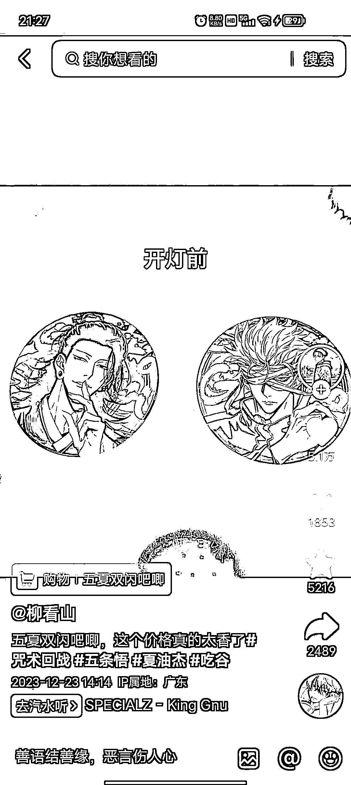
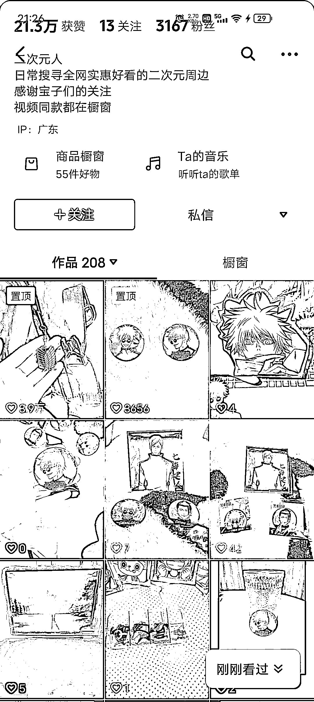
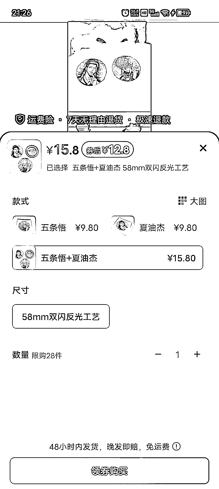
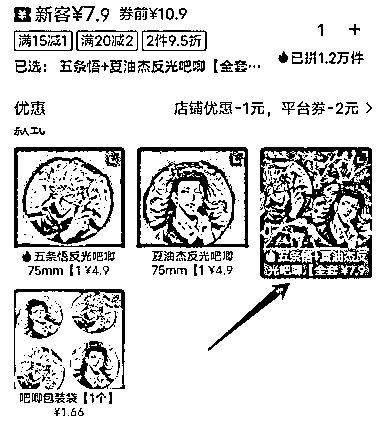

# 二次元周边市场挖掘：低成本引流，私域流量变现的小路子

> 原文：[`www.yuque.com/for_lazy/xkrm14/aen1cbn3cacht4r6`](https://www.yuque.com/for_lazy/xkrm14/aen1cbn3cacht4r6)

作者： 月

日期：2024-01-04

点赞数：**30**

* * *

正文：

某音月销量 7097，3000 粉的一个小号爆一个 3.9w，一个 5.1w 点赞视频 视频 200 个爆了 2 个，单价 15 左右，拼夕夕 7 元拿货，利润率 50%左右
需求：二次元低成本周边，热门番剧学生党消费，贴纸归属感身份标签，认同感 产品：低成本挂件，贴纸
流量：1.自媒体视频：混剪引流/产品展示，成本低，素材多，效果好， 2.cos 现场佩戴，免费分发给番剧优质相关 coser-现场销售（身份认同）
变现：产品出售，私域流量池，相关周边延展，以此产品作为低成本引流端口 贴纸，配饰，装饰（配饰，线管角色配饰等） 风险：正版授权风险
是一个挣小钱的小路子，想挣大钱需要找到正版授权产品，把私域流量转化
从低门槛思域引流，运营社群，制造二次元圈子，发起各类私域流量活动，番剧线报，以及各类二次元快讯，做自己 二次元 IP 才能实现
PS:第一次参与风向标，时间紧张晚上，9 点左右结束的小金老师风向标课程，知道了灰豚，灰豚的红薯版本需要申请，还没通过，包括（日历，发卡等）只想到这么多，各位多提意见，内容是否应该增加更多角度分析？以后会增加更多内容

* * *

评论区：

月 : 谢谢亦仁老师 第一次参与就中标了 我会继续努力！[鼓掌]

* * *

公众号搜索，懒人专属群分享