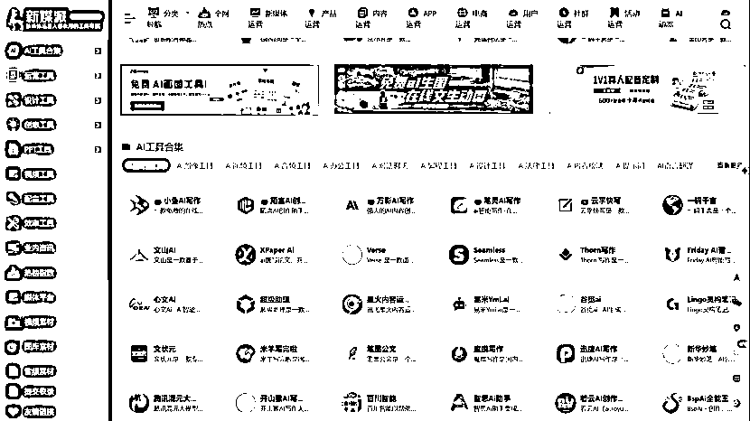

# 工具集成平台，实现工具的 CPS 分销

> 原文：[`www.yuque.com/for_lazy/xkrm14/mw8882mkv1kr8di8`](https://www.yuque.com/for_lazy/xkrm14/mw8882mkv1kr8di8)

作者： 徐 Ken

日期：2024-01-02

点赞数：**13**

* * *

正文：

工具集成平台，做各个工具的 CPS 分销。
对于自媒体人，如果有好用的工具，能起到事半功倍的效果。面对自媒体人的需求，做一个工具集成类网站，挂上带有自己分销码的链接，做工具的 CPS 分销。
对于流量来源，因为是免费提供信息，本着真诚利他的初心，能更快地聚集用户。可以加入各种自媒体社群，多分享好用的工具，引流到私域。或者在抖音、快手等平台分享工具使用教程视频（可以让软件开发商提供），引流到公众号或微信。
对于变现方式，可以做软件 CPS。如果用户量达到一定数量，也可以卖软件广告位。甚至可以卖配套服务，包括搭建同样的网站以及如何引流变现。
对于成本，开发网站和租用服务器总成本可以控制在两千以内，资金投入不大，风险可控。

* * *

评论区：

暂无评论

* * *

公众号搜索，懒人专属群分享