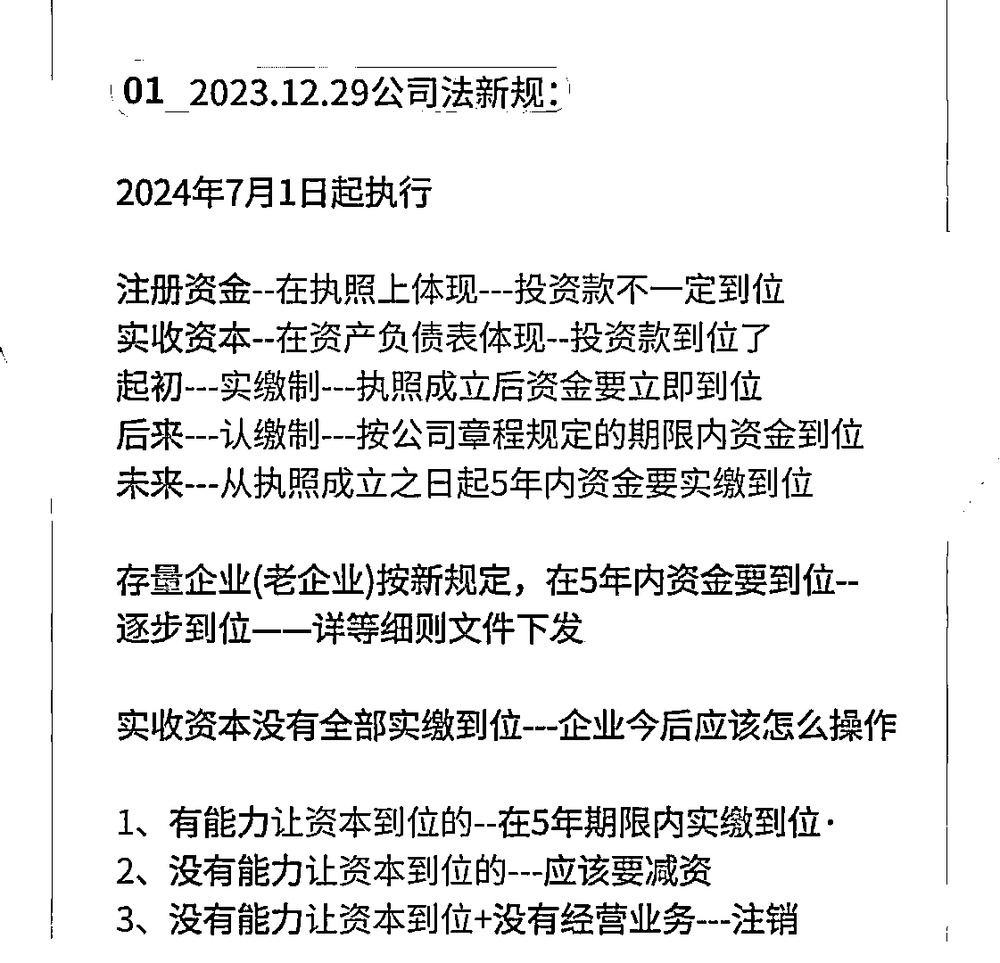
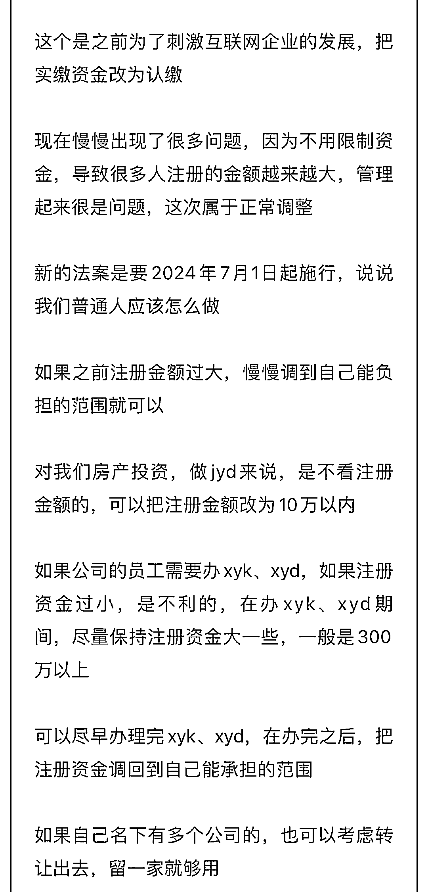

# 新公司法生效，注册资金由认缴改为实缴，对老公司有何影响？

> 原文：[`www.yuque.com/for_lazy/xkrm14/htvbxfhrcz3ig4ff`](https://www.yuque.com/for_lazy/xkrm14/htvbxfhrcz3ig4ff)

作者： 薇姐创富

日期：2024-01-05

点赞数：**44**

* * *

正文：

新公司法生效，注册资金由认缴改为实缴，从 2024 年 7 月 1 号起实行。 新公司新办法，老公司老办法，等进一步细则， 对有老公司的人来说，需要做的
不用的注销，有用的减资，第三才是实缴
至于实缴的金额或者减资的金额可以参考图二，如果是做贷 k 用的空壳公司，10 万就可以了，如果是自己员工要办信用卡信用贷的可以弄几百万 可作为引流，也可做业务

* * *

评论区：

* * *

公众号搜索，懒人专属群分享